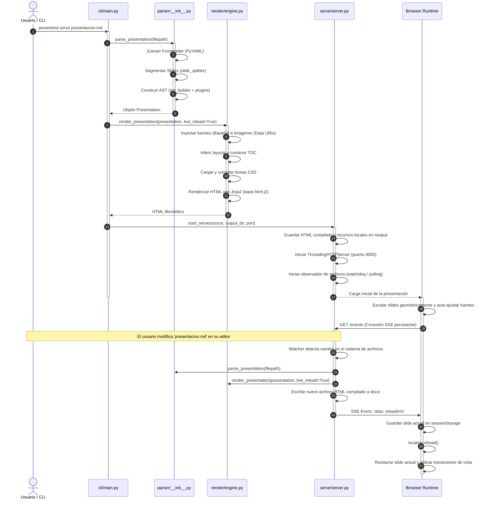

# Documento de Arquitectura Técnica y Diseño de Implementación: PresentMD

**Versión:** 1.1 (Actualizado de acuerdo al código fuente real)  
**Autor:** Principal Software Architect & Technical Writer  
**Estado:** Confirmado por Auditoría de Código  

---

## 1. Visión General de la Arquitectura (High-Level Overview)

PresentMD está diseñado bajo el patrón arquitectónico de **Generador de Sitios Estáticos (SSG) Desacoplado** con un **Runtime en Cliente sin Framework (Zero-Framework Runtime)**. El sistema separa estrictamente las preocupaciones en dos fases de ejecución:

```
┌─────────────────────────────────────────────────────────────┐
│                 FASE DE COMPILACIÓN (Python)                │
│  Ingesta de datos, parsing de AST, inferencia de layouts,   │
│  resolución de temas e inlining de recursos estáticos.      │
└──────────────────────────────┬──────────────────────────────┘
                               │ Compila a HTML Monolítico
                               ▼
┌─────────────────────────────────────────────────────────────┐
│                 FASE DE PRESENTACIÓN (Browser)              │
│  Navegación secuencial, transiciones de vista cinemáticas,  │
│  dibujo en lienzo, consola dual offline y Mermaid nativo.   │
└─────────────────────────────────────────────────────────────┘
```

### Justificación Técnica de la Estructura:
1. **Separación de Ciclos de Vida:** Las tareas complejas de E/S, la validación de archivos, el análisis léxico (tokenización) y la compilación estructural se delegan a un entorno seguro y de tipado estático en tiempo de ejecución (Python 3.12+).
2. **Eliminación de Sobrecarga en el Cliente:** El runtime de la presentación en el navegador utiliza JavaScript Vanilla y CSS puro para maximizar la tasa de refresco (60 FPS estables) y reducir el consumo de memoria en dispositivos embebidos o portátiles.
3. **Portabilidad y Resiliencia Offline:** El resultado de la compilación es un único archivo HTML monolítico. Todos los recursos (fuentes tipográficas, layouts de CSS, controladores JS y logotipos) se inyectan directamente en el documento (mediante Base64 o inlining de texto), garantizando que la presentación funcione al 100% sin conexión a internet y sin necesidad de montar un servidor de producción local.
4. **Simplificación del Entorno de Ejecución:** Se eliminan dependencias del sistema y de red mediante la delegación del renderizado de diagramas al cliente (Mermaid) y la exportación de PDFs al navegador (Ctrl + P), reduciendo el peso de la instalación y mitigando riesgos de seguridad derivados de subprocesos externos.

---

## 2. Estructura del Proyecto y Capas (Directory & Layering Structure)

### 2.1 Árbol de Directorios Real
El código de la aplicación se organiza bajo una estructura modular de paquetes en la carpeta `src/presentmd/`:

```
src/presentmd/
├── cli/
│   ├── __init__.py
│   └── main.py              # CLI principal de Typer y Rich
├── parser/
│   ├── __init__.py          # Orquestador del pipeline de parsing
│   ├── ast_builder.py       # Conversor de tokens de markdown-it a SlideElements
│   ├── frontmatter.py       # Extractor y validador de metadatos YAML
│   ├── models.py            # Modelos de datos del AST (Presentation, Slide, Element)
│   ├── plugins.py           # Extensiones de tokenización de markdown-it-py
│   └── slide_splitter.py    # Segmentador de láminas por '---' y notas de orador
├── plugins/
│   ├── __init__.py
│   ├── components/          # Directorio de plugins de componentes autodescubiertos
│   │   ├── __init__.py
│   │   ├── alert.py
│   │   ├── kpi_grid.py
│   │   └── ... (24 componentes más)
│   └── registry.py          # Registro central extensible de plugins ComponentPlugin
├── render/
│   ├── __init__.py
│   ├── code_highlighter.py  # Resaltador de sintaxis para bloques de código
│   ├── engine.py            # Compilador Jinja2, logo enliner y inyector de CSS/Fonts
│   ├── html_builder.py      # Conversor de SlideElements en cadenas de HTML semántico
│   ├── layout_inference.py  # Algoritmo de mapeo de plantillas por heurística
│   ├── theme_manager.py     # Gestor de búsqueda y carga de archivos de estilos CSS
│   └── toc_builder.py       # Generador estructural del Table of Contents (TOC)
├── serve/
│   ├── __init__.py
│   └── server.py            # Servidor HTTP multihilo y disparador de eventos SSE
└── templates/               # Activos estáticos y plantillas Jinja2
    ├── base.html.j2         # Esqueleto HTML de la presentación interactiva
    ├── fonts/               # Tipografía local DM Mono en formato WOFF2
    ├── layouts/             # Plantillas de distribución espacial de diapositivas
    └── themes/              # Hojas de estilo CSS estructuradas por temas
```

### 2.2 Responsabilidades de las Capas y Reglas de Dependencia
El sistema opera bajo un flujo de dependencias estrictamente unidireccional y acíclico, fluyendo desde las interfaces externas hacia el núcleo de datos:

```
┌────────────────────────────────────────────────────────┐
│                        Capa CLI                        │
│                (src/presentmd/cli/)                    │
└───────────────────────────┬────────────────────────────┘
                            │ Llama
                            ▼
┌────────────────────────────────────────────────────────┐
│                    Capa de Servicio                    │
│               (src/presentmd/serve/)                   │
└───────────────────────────┬────────────────────────────┘
                            │ Compila y recarga
                            ▼
┌────────────────────────────────────────────────────────┐
│                     Capa de Render                     │
│               (src/presentmd/render/)                  │
└───────────────────────────┬────────────────────────────┘
                            │ Transforma AST
                            ▼
┌────────────────────────────────────────────────────────┐
│                     Capa de Parser                     │
│               (src/presentmd/parser/)                  │
└───────────────────────────┬────────────────────────────┘
                            │ Define
                            ▼
┌────────────────────────────────────────────────────────┐
│                   Capa de Dominio/AST                  │
│             (src/presentmd/parser/models.py)           │
└────────────────────────────────────────────────────────┘
```

*   **Reglas de Flujo Estrictas:**
    1.  **Independencia de la Capa de Dominio:** `parser/models.py` no posee dependencias internas. Define los tipos de datos abstractos y estructurados utilizados por todas las demás capas.
    2.  **Aislamiento del Parser:** La capa `parser` procesa texto plano y genera modelos `Presentation`/`Slide`. No conoce la existencia de los temas visuales ni la infraestructura del servidor de desarrollo.
    3.  **Responsabilidad de Renderizado:** La capa `render` consume objetos del AST y los transforma en HTML interactivo utilizando layouts de `templates/layouts/` y CSS de `templates/themes/`. Tiene prohibido modificar el contenido original del AST.
    4.  **Orquestación de CLI:** `cli/main.py` actúa como el controlador principal de ejecución (`Controller`). Importa el parser, el renderizador y el servidor HTTP para implementar los casos de uso del usuario.

---

## 3. Componentes Clave del Sistema (Core Components & Modules)

### 3.1 El Pipeline del Parser (`parser/__init__.py`)
La función `parse_presentation(path)` coordina la lectura, extracción de metadatos y tokenización del archivo fuente en Markdown.

*   **Fase 1: Extracción del Frontmatter (`parser/frontmatter.py`):**
    Utiliza la expresión regular `\A---\s*\n(.*?)\n---\s*\n?` con la bandera `re.DOTALL` para aislar el encabezado del archivo. El contenido del bloque es procesado mediante `yaml.safe_load`. Se valida que el resultado sea un mapeo estructurado (`dict`); de lo contrario, se genera una excepción `ValueError`.
*   **Fase 2: Segmentación de Slides (`parser/slide_splitter.py`):**
    Divide el archivo utilizando la marca lógica `---`. El algoritmo implementa un analizador de estado básico de una sola pasada (`single-pass state analyzer`) para ignorar las marcas `---` que se encuentran dentro de bloques de código (delimitados por ```` ````) o dentro de directivas de contenedor de PresentMD (delimitados por `:::`). De forma simultánea, extrae los comentarios HTML `<!-- notes -->...<!-- /notes -->` y los bloques `:::notes...:::` para asignarlos al campo `speaker_notes` del objeto `Slide`.
*   **Fase 3: Tokenización AST Extensible (`parser/ast_builder.py`):**
    Configura una instancia del tokenizador `MarkdownIt` e inyecta cinco plugins a nivel del analizador léxico:
    *   `layout_directive_plugin`: Intercepta la directiva `::layout{nombre}` para definir la plantilla visual.
    *   `bg_image_directive_plugin`: Captura `::bg-image{src="..." opacity="..."}` para aplicar imágenes de fondo en los slides.
    *   `container_plugin`: Intercepta bloques del tipo `:::nombre_componente {atributos}` ... `:::`.
    *   `badge_plugin`: Identifica elementos de badge inline `[texto]{.clase}`.
    *   `mark_plugin`: Detecta resaltados de texto mediante la sintaxis nativa `==texto==` y los envuelve en tokens de tipo `mark`.
    El método `_convert_tokens_to_elements` recorre linealmente los tokens resultantes, extrayendo metadatos detallados (por ejemplo, los pasos de resaltado dinámico de líneas de código `{1|2-3|all}` o las coordenadas espaciales de los pins en el componente `hotspots`) y construye el árbol jerárquico de objetos `SlideElement`.

### 3.2 El Registro de Componentes (`plugins/registry.py`)
Maneja la extensibilidad y el desacoplamiento de componentes. Define el protocolo `ComponentPlugin`:

```python
class ComponentPlugin(Protocol):
    @property
    def name(self) -> str: ...
    def parse_metadata(self, content: str, attrs: Dict[str, Any]) -> Dict[str, Any]: ...
    def render_html(self, content: str, metadata: Dict[str, Any], render_inline: callable) -> str: ...
```

Durante la inicialización, la función `discover_plugins()` inspecciona dinámicamente el paquete `presentmd.plugins.components` e importa todas las clases que implementen este protocolo, registrándolas en la instancia global `component_registry`. Esto permite agregar nuevos elementos (como gráficos de barras, diagramas de procesos o paneles de pestañas) simplemente creando un archivo en el subdirectorio de componentes, sin modificar el núcleo del compilador.

### 3.3 El Motor de Compilación y Renderizado (`render/engine.py`)
Encapsula la orquestación del motor de plantillas Jinja2 (`FileSystemLoader`) y la resolución del entregable estático final.
*   **Inlining de Fuentes y Logotipos:** Lee la tipografía local `DMMono-Regular.woff2` y la incrusta en el HTML como regla `@font-face` con codificación Base64. De la misma manera, lee la ruta del logo definida en el frontmatter, comprueba su existencia en el disco local y lo convierte a un Data URI seguro en Base64.
*   **Inferencia de Layouts (`render/layout_inference.py`):**
    Si un slide no posee una directiva `::layout{}` explícita, se aplica una heurística automática:
    *   Si el slide solo contiene encabezados H1/H2 y párrafos de longitud inferior a 120 caracteres, se le asigna el layout `title`.
    *   Si contiene una tabla con más de 5 filas o el contenido de texto supera los 1200 caracteres, se le asigna el layout `scrollable`.
    *   De lo contrario, se asigna el layout por defecto `standard`.
*   **Gestión de Temas (`render/theme_manager.py`):**
    Busca la hoja de estilos CSS correspondiente al tema indicado. El orden de prioridad de búsqueda es:
    1.  Directorio del usuario en la carpeta local de configuraciones: `~/.config/presentmd/themes/<tema>/styles.css` (en Linux/macOS) o `%APPDATA%\presentmd\themes\<tema>\styles.css` (en Windows).
    2.  Carpeta interna de plantillas de la librería: `templates/themes/<tema>/styles.css`.
    3.  Tema base de respaldo: `templates/themes/nexus-blueprint/styles.css`.

### 3.4 Servidor de Desarrollo con SSE (`serve/server.py`)
Proporciona un entorno interactivo local de edición en tiempo real.
*   **Orquestador de Compilación:** Realiza una compilación inicial, crea el directorio `output/` y copia los activos e imágenes locales encontrados en el directorio base del archivo fuente.
*   **Vigilancia del Sistema de Archivos:** Intenta cargar la librería `watchdog` para reaccionar ante los eventos de modificación de archivos provistos por el sistema operativo. En caso de no estar instalada, utiliza un bucle de polling que ejecuta un chequeo de tiempo de modificación física (`os.stat().st_mtime`) cada 500ms.
*   **Live-Reload a través de Server-Sent Events (SSE):**
    El handler del servidor HTTP expone el endpoint `/events` configurado como `text/event-stream`. Al detectarse un cambio en el archivo de texto y compilarse con éxito el nuevo HTML en disco, se recorre la lista thread-safe de clientes activos (`_sse_clients`) señalando sus respectivos objetos `threading.Event` para escribir el mensaje `data: reload\n\n` en los sockets de los navegadores conectados.

### 3.5 Runtime del Cliente (JavaScript Vanilla en `base.html.j2`)
Inyectado como una función autoejecutable (IIFE), gestiona la experiencia interactiva en el cliente:
*   **Control del Estado y Consola Dual:** Sincroniza la navegación utilizando `sessionStorage` (`pmd_current_slide`). Al iniciar la vista de presentador (`?presenter=true`) en una segunda ventana, el runtime escucha el evento `storage` local y usa `postMessage` para sincronizar de forma bidireccional el slide activo y el índice de paso dinámico.
*   **Navegación No Lineal y Anexos:** Los slides que poseen el layout `annex` se marcan en el DOM con `data-annex="true"`. Son excluidos de la numeración secuencial de la presentación. Al hacer clic en un enlace de detalle (`[ver](#anexo-a)`), el índice de la diapositiva de origen se almacena en una pila de historial (`history.push(current)`) y se transiciona al anexo. El botón "Volver" realiza un retorno inmediato recuperando el índice de la pila (`history.pop()`).
*   **Resaltado dinámico de código y Stepping:** Controla la visibilidad de los sub-pasos dentro de un slide (`:::steps`, `:::layer-stack`, etc.). En los bloques de código, lee los pasos configurados y aplica clases de opacidad reducida (`0.3`) a todas las líneas que no estén activas en el sub-paso actual.
*   **Algoritmo de Auto-Escalado (Fit-to-Screen):**
    Resuelve los problemas de desbordamiento visual de fuentes en dos fases coordinadas:
    1.  *Escalado Geométrico:* Calcula el valor mínimo del factor de escala según el ancho y alto del viewport contra la base de aspecto de 1280px x 720px y aplica `transform: scale(factor)` sobre el contenedor del slide.
    2.  *Ajuste Fino de Fuente:* Si tras el escalado geométrico la altura del contenido real (`slide.scrollHeight`) supera los 720px del límite físico de la lámina, el runtime disminuye progresivamente la propiedad de tamaño de fuente del elemento raíz (`html`) en pasos de 2% hasta ajustar el contenido al viewport, deteniéndose al alcanzar el límite inferior de seguridad del 60% (9.6px).

---

## 4. Flujo de Datos y Ciclo de Vida (Data Flow & Request Lifecycle)

El ciclo de vida de compilación y visualización sigue los pasos secuenciales descritos a continuación:



### Notas sobre el procesamiento de Gráficos y Exportación:
*   **Renderizado de Diagramas (Mermaid):** Durante la fase de renderizado en Python, los diagramas Mermaid son inyectados de forma pasiva en bloques `<pre class="mermaid">` conteniendo el código fuente exacto en texto plano. No se ejecutan procesos secundarios en el servidor. Al cargarse el HTML en el cliente, la librería externa de Mermaid incrustada en la plantilla compila localmente el texto y renderiza el SVG en el DOM. El soporte para herramientas CLI de diagramación como D2 y compiladores de terminal NodeJS como `mmdc` está completamente desactivado del lado del servidor.
*   **Pipeline de Exportación a PDF:** Cuando el usuario ejecuta `presentmd build presentacion.md --format pdf`, el compilador genera el archivo HTML final estático con todas las fuentes y logotipos inyectados en la carpeta `output/`. Para asegurar el renderizado estático óptimo de los elementos interactivos del DOM y evitar la sobrecarga de instalar librerías pesadas como Playwright, la compilación de PDF se delega a las capacidades nativas de impresión del navegador. El documento CSS define reglas `@media print` específicas que aíslan la lámina activa, eliminan barras de navegación y controles interactivos y formatean la salida para una maquetación pixel-perfect en relación de aspecto de 16:9.

---

## 5. Patrones de Diseño e Integraciones (Design Patterns & Ecosystem)

### 5.1 Patrones de Diseño Implementados

*   **Registry Pattern (Patrón Registro):**
    El objeto `ComponentRegistry` en `plugins/registry.py` implementa este patrón, manteniendo un inventario dinámico indexado de plugins de visualización personalizados. Esto aisla la lógica de parsing genérica de la especificación técnica de renderizado de cada componente.
*   **Strategy / Polymorphism (Patrón Estrategia):**
    El resolvedor de elementos en `html_builder.py` despacha la acción de renderizado polimórficamente. Si el elemento posee el tipo `container_`, localiza la estrategia del componente en el registro central y ejecuta su método `render_html`, delegando el algoritmo visual al plugin correspondiente.
*   **Pipeline Pattern (Patrón Tubería):**
    El flujo de procesamiento implementado en `parser.parse_presentation` ejecuta un pipeline de transformación de datos lineal y unidireccional: `File Ingestion` -> `Frontmatter Extraction` -> `Slide Splitting` -> `AST Generation` -> `Presentation Packaging`.
*   **Observer Pattern (Patrón Observador):**
    *   *Backend:* El servidor de desarrollo se suscribe a los eventos del sistema de archivos mediante la interfaz de observadores de `watchdog`.
    *   *Frontend:* Los componentes estructurados SmartArt del cliente (como `PmdPyramid` y `PmdSmartArtBase`) instancian un `MutationObserver` en JavaScript para vigilar la clase de visibilidad de los elementos del DOM y re-renderizar dinámicamente los gráficos vectoriales SVG del cliente cuando se activa un sub-paso.
*   **Fallback / Degradación Aceptable:**
    El sistema cuenta con múltiples alternativas de ejecución automática:
    - Uso de *polling* si la librería `watchdog` no está disponible.
    - Fallback a la plantilla de diapositiva estándar si el layout personalizado indicado en el frontmatter no se encuentra en el disco.
    - Fallback de animación por opacidad estándar si el navegador no cuenta con soporte para el View Transitions API.

### 5.2 Integración con Librerías del Ecosistema

Las dependencias de infraestructura están declaradas y validadas por el archivo `pyproject.toml` bajo el build-backend `hatchling`:

*   **`typer` (con `click`):** Controla el mapeo de los comandos CLI del usuario y sus opciones.
*   **`rich`:** Permite generar el formateo enriquecido de la consola en la terminal de diagnóstico (`doctor`), la visualización jerárquica del AST (`debug`) y los paneles informativos del compilador.
*   **`markdown-it-py`:** Analizador de sintaxis estructurada rápido y compatible con CommonMark, utilizado como base de tokenización del compilador.
*   **`PyYAML`:** Ingesta y parsing seguro de metadatos de configuración de la presentación.
*   **`Jinja2`:** Motor de plantillas que unifica los fragmentos HTML semánticos en el esqueleto de visualización.
*   **`watchdog`:** Integración opcional (`serve`) para monitorear eventos del sistema de archivos.
*   **`pytest`:** Infraestructura de ejecución de pruebas unitarias y de integración.

---

## 6. Manejo de Errores, Resiliencia y Seguridad

### 6.1 Estrategia de Control de Errores y Resiliencia
El framework gestiona las excepciones de forma controlada en todas las capas:
*   **Validaciones en el CLI:** Las excepciones arrojadas por archivos faltantes o estructuras de metadatos YAML rotas son capturadas en `cli/main.py` empleando bloques `try-except` dedicados. Se genera una salida visual con descripciones y trazas de depuración estructuradas, deteniendo la ejecución mediante códigos de salida controlados (`typer.Exit(code=1)`).
*   **Resiliencia del Servidor HTTP:** El servidor HTTP local intercepta y descarta de forma silenciosa errores comunes de socket tales como `BrokenPipeError`, `ConnectionResetError` y `OSError` producidos cuando un navegador cierra abruptamente la conexión de eventos SSE `/events`, previniendo la caída del proceso de desarrollo en consola.
*   **Recuperación en el Cliente:** La comunicación mediante almacenamiento compartido y paso de mensajes bidireccional valida la integridad de los índices numéricos recibidos. En caso de recibir un slide ID inexistente, el motor realiza un fallback de seguridad y carga la primera diapositiva de la presentación.

### 6.2 Directrices y Mecanismos de Seguridad
Dado que PresentMD es una herramienta de compilación local y de distribución estática, se implementan protecciones críticas en el código para prevenir ejecuciones de código no autorizadas o accesos ilegítimos al sistema de archivos del usuario:

*   **Prevención de Path Traversal (Ataques de Directorio):**
    El inyector del logo y de imágenes de fondo valida rigurosamente las rutas relativas. El método `_get_logo_data_uri` en `render/engine.py` resuelve la ruta absoluta del recurso y verifica explícitamente si se encuentra contenida de forma estricta dentro del directorio de trabajo de la presentación:
    ```python
    logo_path = (presentation_dir / logo_path_str).resolve()
    if not logo_path.is_relative_to(presentation_dir.resolve()):
        # Se deniega el acceso al recurso externo
    ```
    Esto impide que una diapositiva maliciosa intente inyectar y codificar en base64 archivos confidenciales del sistema de archivos del usuario (como claves SSH o archivos `/etc/passwd`).
*   **Validación Estricta de Extensiones y MIME Types:**
    Los recursos que se inyectan dinámicamente como Data URIs son analizados previamente. Se restringe el procesamiento del logo a un conjunto explícito y seguro de extensiones de imagen: `.png`, `.jpg`, `.jpeg`, `.svg`, `.gif` y `.webp`.
*   **Desactivación de Subprocesos Externos Vulnerables:**
    Debido a que el parsing de bloques de código de diagramación solía ejecutar herramientas del sistema de forma directa (como traductores CLI de D2 o ejecutables de node en la terminal), se ha eliminado por completo la invocación de subprocesos a comandos externos de traducción. Esto anula toda posibilidad de vulnerabilidades por inyección de comandos en terminal (`Command Injection`) a través de fragmentos de Markdown maliciosos.
*   **Sanitización y Escapado de Salida:**
    Todos los textos e información procesados a nivel de títulos, metaetiquetas y nombres de layouts son escapados de forma nativa a través del motor autoescape de Jinja2 y llamadas a `html.escape()`, previniendo ataques de Cross-Site Scripting (XSS) en las diapositivas compiladas.
