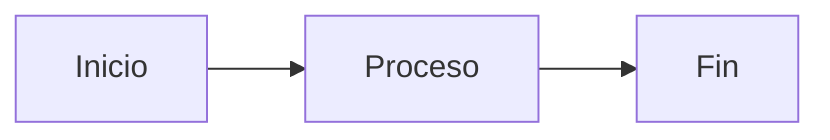

# 📘 Manual de Referencia Definitivo del Lenguaje PresentMD

**Versión:** 1.0 · Junio 2026
**Motor:** Python 3.12+ · Vanilla JS · CSS Custom Properties
**Licencia:** Uso interno

---

## 📑 Tabla de Contenidos

1. [Introducción y Filosofía del Lenguaje](#-1-introducción-y-filosofía-del-lenguaje)
2. [Configuración Global (Frontmatter YAML)](#-2-configuración-global-frontmatter-yaml)
3. [Estructura del Documento y Layouts](#-3-estructura-del-documento-y-layouts)
4. [Componentes de Bloque (Contenedores `:::`)](#-4-componentes-de-bloque-contenedores-)
5. [Tipografía, Elementos Inline y Navegación](#-5-tipografía-elementos-inline-y-navegación)
6. [Contenido Técnico: Código y Diagramas](#-6-contenido-técnico-código-y-diagramas)
7. [Interactividad y Stepping (Motor de Pasos)](#-7-interactividad-y-stepping-motor-de-pasos)
8. [Herramientas de Presentador y UI en Vivo](#-8-herramientas-de-presentador-y-ui-en-vivo)
9. [CLI y Pipeline de Build](#-9-cli-y-pipeline-de-build)
10. [Apéndice: Hoja de Trucos (Cheat Sheet)](#-10-apéndice-hoja-de-trucos-cheat-sheet)

---

## 🎯 1. Introducción y Filosofía del Lenguaje

### ¿Qué es PresentMD?

PresentMD es un **compilador de presentaciones profesionales** que transforma documentos Markdown enriquecidos en diapositivas web interactivas (HTML autocontenido) y archivos PDF de alta resolución. Está diseñado específicamente para **desarrolladores, arquitectos de software y modeladores de datos** que necesitan presentaciones técnicas impecables sin abandonar su editor de texto.

### Filosofía de Diseño

PresentMD se rige por tres principios fundamentales:

| Principio | Descripción |
|---|---|
| **Markdown-First** | El usuario escribe texto plano con directivas semánticas. Nunca escribe HTML. El motor se encarga de todo el renderizado visual. |
| **Declarativo** | El autor describe **qué** quiere mostrar (un KPI, una timeline, un diagrama), no **cómo** posicionarlo pixel a pixel. La filosofía es "80% contenido, 20% impacto visual". |
| **Offline y Autocontenido** | La salida HTML es un único archivo que embebe fuentes (Base64), imágenes y estilos. No requiere CDN, frameworks JS, ni conexión a internet para funcionar. |

### Stack Tecnológico

| Componente | Tecnología | Propósito |
|---|---|---|
| CLI Engine | `typer` + `rich` | Comandos de terminal con UI rica |
| Parser | `markdown-it-py` | Tokenización y AST del Markdown |
| Frontmatter | `PyYAML` | Extracción de metadatos YAML |
| Templates | `Jinja2` | Renderizado de layouts HTML |
| Syntax Highlighting | `Pygments` | Resaltado de código server-side |
| PDF Export | `playwright` (opcional) | Impresión headless a PDF |
| Diagramas | `d2` CLI, `mmdc` (Mermaid CLI) | Compilación de diagramas a SVG |

### Diferencias con Otras Herramientas

| Característica | PresentMD | Slidev | Marp |
|---|---|---|---|
| Runtime JS | Ninguno (Vanilla JS) | Vue.js + Vite | Ninguno |
| Componentes custom | Directivas `:::` nativas | Componentes Vue | Limitado a Markdown |
| Diagramas | D2 + Mermaid (build-time SVG) | Mermaid (client-side) | Mermaid (client-side) |
| Code Stepping | `{1\|2-3\|all}` nativo | Plugin requerido | No soportado |
| Temas | CSS Variables + 11 temas built-in | Temas UnoCSS | Temas CSS |
| Output | HTML autocontenido (Base64) | SPA con assets | HTML/PDF |
| Modo Presentador | Dual-window offline | Dual-window (requiere server) | No incluido |

> [!IMPORTANT]
> **Restricción Arquitectónica:** PresentMD **prohíbe** el uso de frameworks JS (React, Vue, Svelte, Node.js). Todo el frontend es Vanilla JS y CSS Grid/Custom Properties.

### 🏛️ Desacoplamiento Estricto de Estilos (Zero-Inline-Styles)

A partir de la versión 0.8, PresentMD adopta una política estricta de **cero estilos estéticos in line** inyectados desde Python. La arquitectura separa claramente las responsabilidades:
- **Python (AST y Estructura):** Procesa el Markdown y genera marcado HTML semántico enriquecido exclusivamente con atributos de datos (`data-*`), tales como `data-cols`, `data-step-idx`, `data-clip-path`, `data-left`, etc.
- **CSS (Diseño y Temas):** Define la apariencia visual (colores, fuentes, bordes) basándose en clases CSS semánticas y variables.
- **JavaScript (Runtime):** Lee los atributos `data-*` al cargar la presentación y mapea de forma dinámica las propiedades personalizadas de CSS (`--*`) o estilos de posicionamiento matemático en el DOM.

Esto garantiza la portabilidad del motor y permite que cualquier tema CSS modifique completamente la estética de los componentes visuales complejos sin hackear el código del compilador.

---

## ⚙️ 2. Configuración Global (Frontmatter YAML)

### Concepto

Cada archivo `.md` de PresentMD comienza con un bloque **YAML Frontmatter** delimitado por dos líneas `---`. Este bloque define los metadatos globales que controlan el tema visual, las opciones de UI, el logo corporativo y el comportamiento general de la presentación.

### Sintaxis Base

```yaml
---
title: "Mi Presentación Técnica"
theme: nexus-blueprint
accent: "#C8006B"
footer: "Confidencial · Q1 2026"
logo: logo.png
logo_position: bottom
nav_arrows: true
slide_number: true
animations: true
closing_message: "¡Gracias!"
closing_subtitle: "¿Preguntas?"
---
```

> [!NOTE]
> **Cómo funciona el parser:** El módulo `frontmatter.py` utiliza un regex `\A---\s*\n(.*?)\n---\s*\n?` con el flag `re.DOTALL` para capturar todo el contenido entre los dos delimitadores `---`. Luego lo procesa con `yaml.safe_load()`. Si el bloque YAML está vacío, retorna un diccionario vacío `{}`. Si el YAML es inválido, lanza un `ValueError`.

### Tabla Exhaustiva de Claves

| Clave | Tipo | Valor por Defecto | Descripción |
|---|---|---|---|
| `title` | `string` | `"Sin título"` | Título de la presentación. Se usa en el `<title>` HTML, en la portada, y como meta OpenGraph. |
| `theme` | `string` | `"nexus-blueprint"` | Nombre del tema CSS a aplicar. Debe coincidir con un directorio en `templates/themes/` o en `~/.config/presentmd/themes/`. |
| `accent` | `string` (hex) | Definido por el tema | Color de acento primario. Sobrescribe `--accent-primary` del tema. Formato: `"#C8006B"`. Se inyecta como `:root { --accent-primary: <valor>; }` antes del CSS del tema. |
| `footer` | `string` | `""` (vacío) | Texto del pie de página que aparece en la esquina inferior de cada slide (excepto `layout-title`). |
| `logo` | `string` (ruta) | `""` (vacío) | Ruta relativa a una imagen de logo. Se convierte a Data URI Base64 para autocontención. Formatos válidos: `.png`, `.jpg`, `.jpeg`, `.svg`, `.gif`, `.webp`. |
| `logo_position` | `string` | `"top"` | Posición del logo en el slide de portada (`layout-title`). Valores aceptados: `"top"` (arriba del título) y `"bottom"` (debajo del título, 60px desde el borde inferior). |
| `nav_arrows` | `boolean` | `false` | Si es `true`, muestra flechas de navegación `←` `→` en la interfaz. |
| `slide_number` | `boolean` | `false` | Si es `true`, muestra el contador de diapositivas (ej. `3 / 15`) en la barra de controles. Los slides de tipo `annex` se excluyen del conteo. |
| `animations` | `boolean` | `false` | Si es `true`, habilita las animaciones CSS de entrada para elementos (fade-in, slide-up). |
| `closing_message` | `string` | `""` (vacío) | Texto principal del slide de cierre automático. Si se omite, se repite el `title` de la presentación. Ejemplo: `"¡Gracias por su atención!"`. |
| `closing_subtitle` | `string` | `""` (vacío) | Subtítulo del slide de cierre automático. Aparece debajo del `closing_message`. Ejemplo: `"¿Preguntas?"`. |
| `eyebrow` | `string` | `""` (vacío) | Texto superior (metadato) que aparece encima del H1 en slides `layout-standard`. Usa la fuente monoespaciada en mayúsculas con el color del acento. Sinónimo: `section`. |
| `d2_theme` | `string` (ID) | Deprecado | **DEPRECATED**: Soporte para D2 ha sido eliminado. Use Mermaid para diagramas. |

> [!WARNING]
> **Seguridad en rutas de logo:** El motor aplica una validación de **Path Traversal**. La ruta del logo debe resolver a un archivo dentro del directorio de la presentación. Rutas como `../../etc/passwd` serán denegadas con un error de seguridad.

> [!TIP]
> **Transparencia del logo:** El motor analiza el canal alpha de la imagen PNG (leyendo el byte `color_type` del chunk IHDR). Si detecta que el logo no tiene transparencia (ej. JPG), emite una advertencia recomendando usar PNG con canal alpha o SVG para una mejor integración visual.

### Temas Disponibles (Built-in)

PresentMD incluye **5 temas principales premium** listos para usar, completamente rediseñados para soportar tipografía fluida y movimiento:

| Nombre del Tema | Estética y Personalidad | Esquema de Color Nativo / Soporte Dark Mode |
|---|---|---|
| `nexus-blueprint` | Tema por defecto. Estética tecnológica profesional con acento cobre (#C8006B). | Dark (Inversión automática a modo claro premium). |
| `corporate-dark` | Premium corporativo formal, escala de grises sobria y acentos esmeralda/azul profundo. | Dark (Inversión automática a modo claro). |
| `obsidian-glass` | Estilo glassmorphism futurista, contenedores translúcidos con desenfoque de fondo y acentos cian/violeta. | Dark (Inversión automática a modo claro esmerilado translúcido). |
| `cyber-terminal` | Retro-moderno estilo terminal hacker, monoespaciado con verde neón y ámbar. | Dark (Inversión automática a terminal clara tipo GitHub CLI). |
| `swiss-grid` | Diseño suizo brutalista, alta tensión y contraste con tipografía neo-grotesca y acento rojo vivo. | Light (Inversión automática a modo oscuro brutalista de alto impacto). |
| `aurora-gradient` | Creativo y vibrante con gradientes mesh fluidos (fucsia/celeste) y bordes muy redondeados. | Light (Inversión automática a modo oscuro creativo). |
| `minimal` | Minimalismo tecnológico ultra limpio y aséptico, bordes afilados y acentos azul royal. | Light (Inversión automática a modo oscuro minimalista). |

### Temas Personalizados

Para crear un tema personalizado:

1. Crear directorio: `~/.config/presentmd/themes/mi-tema/`
2. Crear archivo `styles.css` con las variables CSS requeridas
3. Referenciar en el frontmatter: `theme: mi-tema`

El `ThemeManager` busca en este orden:
1. Directorio del usuario (`~/.config/presentmd/themes/<nombre>/styles.css`)
2. Directorio interno (`templates/themes/<nombre>/styles.css`)
3. Fallback: `nexus-blueprint`

### 🎨 Soporte de Color Adaptativo (Auto Light/Dark Mode)

A partir de la versión 0.9, todos los temas soportan de forma nativa e integrada el cambio automático de color basado en la preferencia del sistema mediante `@media (prefers-color-scheme)`:
- Los temas tradicionalmente oscuros (`corporate-dark`, `obsidian-glass`, `cyber-terminal`) se adaptan a un modo claro elegante que mantiene su personalidad visual (ej. el efecto de vidrio esmerilado en modo claro).
- Los temas tradicionalmente claros (`swiss-grid`, `aurora-gradient`, `minimal`) invierten sus colores y contrastes hacia un modo oscuro premium.

### 🏃‍♂️ Motion System (Tokens de Movimiento y Animaciones)

El sistema de movimiento de PresentMD está basado en variables CSS centralizadas y respetuoso de la accesibilidad:
- **Tokens de Curva**: `--ease-out-expo` (suave y rápida, `cubic-bezier(0.16, 1, 0.3, 1)`), `--ease-in-out-quart`, y `--ease-spring` (efecto elástico).
- **Tokens de Duración**: `--duration-fast` (150ms), `--duration-normal` (300ms) y `--duration-slow` (600ms).
- **Transiciones y Elevación**: `--transition` y transformaciones de hover (`--hover-lift: translateY(-4px)`, `--hover-scale: scale(1.02)`).
- **Pure CSS Staggering (Escalonamiento)**: Implementado nativamente mediante selectores `nth-child(n)` en CSS puro para componentes de grid (tarjetas KPI, fases de timeline, cajas de información y tarjetas de características) hasta el 8º hijo:
  ```css
  .kpi-card:nth-child(1) { transition-delay: calc(1 * var(--stagger-step)); }
  .kpi-card:nth-child(2) { transition-delay: calc(2 * var(--stagger-step)); }
  ```
- **Accesibilidad**: Desactivación global de transiciones y animaciones ante la directiva `@media (prefers-reduced-motion: reduce)`.

### 📏 Fluid Typography (Tipografía Fluida)

La escala tipográfica es completamente modular y fluida, adaptándose dinámicamente al tamaño del viewport usando la función `clamp()` en lugar de valores fijos en `rem` o `px`. Esto evita desbordamientos en pantallas medianas o móviles:
- `--text-xs`: de `0.7rem` a `0.8rem`.
- `--text-sm`: de `0.8rem` a `0.95rem`.
- `--text-base`: de `0.95rem` a `1.125rem` (cuerpo de texto).
- `--text-lg`: de `1.1rem` a `1.35rem` (títulos H3).
- `--text-xl`: de `1.25rem` a `1.6rem` (títulos H2, subtítulos).
- `--text-3xl`: de `1.85rem` a `2.5rem` (títulos de slides H1).
- `--text-5xl`: de `2.8rem` a `4.5rem` (portada principal).
- **Control de Párrafo**: Variables de interlineado (`--leading-tight`, `--leading-snug`, `--leading-relaxed`) y tracking (`--tracking-tight`, `--tracking-normal`) integradas en cada tema.

### Variables CSS Mínimas para un Tema

```css
:root {
  /* Colors */
  --accent-primary: #C8006B;
  --accent-secondary: #2563eb;
  --bg-chrome: #1a1a2e;
  --bg-canvas: #f7f7f8;
  --card-bg: #ffffff;
  --text-main: #111111;
  --text-muted: #6b7280;

  /* Spacing & Borders */
  --radius: 8px;
  --shadow-card: 0 2px 8px rgba(0,0,0,0.08);

  /* Motion Tokens */
  --ease-out-expo: cubic-bezier(0.16, 1, 0.3, 1);
  --duration-normal: 300ms;
  --stagger-step: 80ms;
  --transition: var(--duration-normal) var(--ease-out-expo);
  --hover-lift: translateY(-4px);

  /* Fluid Typography Scale */
  --text-xs: clamp(0.7rem, 0.65rem + 0.25vw, 0.8rem);
  --text-sm: clamp(0.8rem, 0.75rem + 0.3vw, 0.95rem);
  --text-base: clamp(0.95rem, 0.9rem + 0.4vw, 1.125rem);
  --text-lg: clamp(1.1rem, 1rem + 0.6vw, 1.35rem);
  --text-xl: clamp(1.25rem, 1.15rem + 0.8vw, 1.6rem);
  --text-3xl: clamp(1.85rem, 1.6rem + 1.5vw, 2.5rem);
  --text-5xl: clamp(2.8rem, 2.4rem + 3vw, 4.5rem);

  --font-body: 'Segoe UI', sans-serif;
  --font-mono: 'DM Mono', monospace;
}
```

---

## 🏗️ 3. Estructura del Documento y Layouts

### 3.1 Separación de Slides

Los slides se separan con una línea horizontal `---` en una línea independiente:

```markdown
## Slide 1
Contenido del primer slide.

---

## Slide 2
Contenido del segundo slide.
```

> [!NOTE]
> **Cómo funciona el parser:** El módulo `slide_splitter.py` recorre el archivo línea por línea buscando líneas que contengan **exclusivamente** `---`. El parser es inteligente: ignora los separadores `---` que aparezcan **dentro de bloques de código** (delimitados por ` ``` `) o **dentro de contenedores** (delimitados por `:::`). Esto permite usar `---` como separador interno dentro de un `:::parallel-compare` sin romper la estructura de slides.

### 3.2 Directivas de Layout

Cada slide puede declarar explícitamente su layout usando la directiva `::layout{nombre}`, colocada inmediatamente después del separador `---`:

```markdown
---

::layout{title}
# Mi Título de Portada
```

> [!IMPORTANT]
> La directiva `::layout{nombre}` debe ser la **primera línea de contenido** del slide (después del `---`). El parser utiliza el regex `^::layout\{([a-zA-Z0-9_-]+)\}\s*$` para detectarla. Si no se encuentra una directiva explícita, el motor **infiere** el layout automáticamente según el contenido del slide.

#### Layouts Disponibles

PresentMD soporta **5 layouts** distintos. A continuación se detalla cada uno:

---

#### A. `title` — Portada / Título de Sección

**Propósito:** Usado para la portada de la presentación o para separadores de sección. Diseñado para captar la atención máxima con tipografía masiva centrada.

**Activación:**
- Explícita: `::layout{title}`
- Inferida automáticamente cuando el slide contiene **solo** un H1, opcionalmente acompañado de un H2 y/o un párrafo corto (menos de 120 caracteres).

**Estructura HTML generada:**

```html
<section class="slide layout-title">
  <div class="title-logo-container"><!-- Logo si logo_position=top --></div>
  <div class="slide-body">
    <h1 class="slide-h1">Título</h1>
    <p>Subtexto opcional</p>
  </div>
  <div class="accent-line"></div><!-- Línea decorativa accent-primary -->
  <div class="title-logo-container logo-bottom"><!-- Logo si logo_position=bottom --></div>
</section>
```

**Comportamiento CSS:**
- Fondo: `--bg-chrome` (oscuro)
- Texto: blanco
- H1: `font-size: clamp(2.4rem, 5vw, 3.6rem)`, `font-weight: 700`
- Línea de acento: 80px de ancho, 4px de alto, color `--accent-primary`
- Centrado vertical y horizontal (Flexbox `justify-content: center`)

**Ejemplo:**

```markdown
::layout{title}
# Arquitectura de Microservicios
## Migración Legacy → Cloud Native
```

---

#### B. `standard` — Contenido Estándar

**Propósito:** El layout por defecto para el 90% de los slides. Diseñado para contener KPIs, texto, código, diagramas y cualquier combinación de componentes.

**Activación:**
- Explícita: `::layout{standard}`
- Inferida automáticamente como **fallback** cuando ninguna otra regla de inferencia aplica.

**Estructura HTML generada:**

```html
<section class="slide layout-standard">
  <div class="slide-header">
    <div class="eyebrow">METADATO</div>
    <h1 class="slide-h1">Título</h1>
    <h2 class="slide-h2">Subtítulo</h2>
  </div>
  <div class="slide-body">
    <!-- Elementos del cuerpo -->
  </div>
  <div class="slide-footer">
    <span class="footer-text">Footer</span>
  </div>
</section>
```

**Comportamiento CSS:**
- CSS Grid de 3 zonas: `grid-template-rows: auto 1fr auto` (header / body / footer)
- Header: fondo `--bg-chrome`, texto blanco
- Body: `overflow-y: auto` con scrollbar personalizada (color `--accent-primary`)
- Dimensiones fijas: `1280px × 720px` (16:9)

> [!WARNING]
> **Desbordamiento:** Si un slide `standard` tiene más de 15 elementos en su body o el contenido total supera los 1200 caracteres, el motor emite una advertencia `⚠ ADVERTENCIA DE DESBORDAMIENTO` en la terminal durante el build. El slide se transforma automáticamente en `scrollable` para evitar que el contenido se corte o desborde visualmente.

---

#### C. `scrollable` — Contenido Largo con Scroll

**Propósito:** Usado para slides con contenido extenso: tablas largas, documentación detallada, o contenido para sesiones de Q&A.

**Activación:**
- Explícita: `::layout{scrollable}`
- Inferida automáticamente cuando:
  - El slide contiene una tabla con más de 5 filas **y** el contenido total supera 400 caracteres.
  - El contenido total del slide supera **1200 caracteres**.

**Diferencia con `standard`:** El `overflow-y: auto` está explícitamente habilitado en el `.slide-body`. Estructuralmente idéntico al `standard` pero sin la restricción de overflow hidden.

---

#### D. `split-comparison` — Comparación en Dos Columnas

**Propósito:** Divide el slide en dos columnas simétricas con un separador central, ideal para comparaciones "Antes vs. Después", "Legacy vs. Moderno", "Productivo vs. Shadow".

**Activación:** Exclusivamente explícita: `::layout{split-comparison}`. **Nunca se infiere automáticamente.**

**Estructura HTML generada:**

```html
<section class="slide layout-standard layout-split-comparison">
  <div class="slide-header">...</div>
  <div class="slide-body">
    <div class="pc-left"><!-- Contenido izquierdo --></div>
    <div class="pc-center"><div class="vs-badge">VS</div></div>
    <div class="pc-right"><!-- Contenido derecho --></div>
  </div>
</section>
```

**Comportamiento CSS:**
- Grid estricto: `grid-template-columns: 1fr 50px 1fr`
- Columna izquierda: tinte `rgba(accent-primary, 0.05)`, borde izquierdo `--accent-primary`
- Columna derecha: tinte `rgba(accent-secondary, 0.05)`, borde izquierdo `--accent-secondary`
- Badge central: tipografía monoespaciada, orientación vertical (`writing-mode: vertical-rl`)

**Separador de columnas:** Se usa `|||` (tres pipes) en una línea independiente para dividir el contenido entre columna izquierda y columna derecha:

```markdown
::layout{split-comparison}
## Comparación de Stacks

Contenido columna izquierda

|||

Contenido columna derecha
```

---

#### E. `annex` — Slide de Anexo

**Propósito:** Slides complementarios que se excluyen de la navegación secuencial y del conteo de diapositivas. Se acceden únicamente mediante deep links (`.link-anexo`).

**Activación:** Exclusivamente explícita: `::layout{annex}`. **Nunca se infiere.**

**Comportamiento especial:**
- Se renderiza con las clases CSS `layout-standard layout-scrollable annex`
- Inyecta el atributo `data-annex="true"` en el `<section>` raíz
- Se reordena al final de la presentación (después del slide de cierre)
- Se excluye del conteo en el indicador de slides (`slide_number`)
- Se lista en el TOC sidebar bajo el encabezado `── Anexos ──` con etiquetas `A1`, `A2`, `A3`
- Inyecta automáticamente un `<button class="btn-volver">← Volver</button>` en el header

**Ejemplo completo con navegación:**

```markdown
## Slide Principal
Consulta el detalle en [Ver Anexo de Costos](#anexo-costos){.link-anexo}

---

::layout{annex}
## Detalle de Costos {#anexo-costos}

Contenido extenso del anexo...

<button class="btn-volver">Volver</button>
```

> [!NOTE]
> **Ancla explícita:** El ID del slide de destino se define con la sintaxis `{#id-slug}` al final del heading. El parser usa el regex `^(.+?)\s*\{#([\w-]+)\}\s*$` para extraer el `anchor_id`. Si no se proporciona, se genera automáticamente un slug del título (ej. `"Detalle de Costos"` → `detalle-de-costos`).

### 3.3 Hero Backgrounds (`::bg-image`)

La directiva `::bg-image` inyecta una imagen de fondo a pantalla completa en cualquier slide. Se posiciona como capa absoluta detrás de todo el contenido.

**Sintaxis:**

```markdown
::bg-image{src="imagen.jpg" opacity="0.15"}
## Mi Slide con Fondo
```

**Atributos:**

| Atributo | Tipo | Requerido | Descripción |
|---|---|---|---|
| `src` | `string` (ruta) | Sí | Ruta relativa a la imagen de fondo. |
| `opacity` | `string` (decimal) | No | Opacidad de la imagen. Rango: `"0.0"` a `"1.0"`. Valor recomendado: `"0.1"` a `"0.2"` para marcas de agua. |

**HTML generado:**

```html
<div class="slide-bg-overlay"
     style="background-image: url('imagen.jpg'); opacity: 0.15;">
</div>
```

**CSS:** La capa se posiciona absolutamente, llenando el 100% del slide, con `z-index: 1` (detrás de todo el contenido que tiene `z-index: 2`).

> [!IMPORTANT]
> **Contexto de apilamiento (Stacking Context):** Para garantizar que el overlay de fondo (`.slide-bg-overlay` con `z-index: 1`) se posicione detrás del contenido del slide pero por delante del fondo del lienzo (canvas) del tema seleccionado, el slide contenedor tiene configurado `isolation: isolate !important;` en el layout general de la aplicación. Al diseñar o depurar temas personalizados, mantenga este aislamiento para evitar que fondos con degradados o colores sólidos en el contenedor principal `.slide` oculten la imagen del héroe.


> [!TIP]
> **Legibilidad del texto:** Para que el texto sea legible sobre una imagen de fondo, usa opacidades bajas (`0.05` a `0.2`). Si necesitas una imagen más visible, considera combinarla con un slide `layout-title` que usa fondo oscuro (`--bg-chrome`).

### 3.4 Slide de Cierre Automático

PresentMD genera automáticamente un **slide de cierre** al final de la presentación (antes de los anexos). Este slide usa el `layout-title` y su contenido se configura mediante el frontmatter:

- Si `closing_message` está definido → lo muestra como H1, con `closing_subtitle` como párrafo.
- Si `closing_message` está vacío → repite el `title` de la presentación y el primer párrafo del slide 0.

### 3.5 Inferencia Automática de Layout

Cuando un slide **no** tiene directiva `::layout{}` explícita, el motor aplica estas reglas en orden:

| Prioridad | Condición | Layout Asignado |
|---|---|---|
| 1 | Solo headings H1/H2 (sin otro contenido) | `title` |
| 2 | Un H1 + un párrafo corto (<120 caracteres) | `title` |
| 3 | Tabla con >5 filas y contenido >400 caracteres | `scrollable` |
| 4 | Contenido total >1200 caracteres | `scrollable` |
| 5 | Cualquier otro caso | `standard` |

> [!IMPORTANT]
> Los layouts `split-comparison` y `annex` **nunca** se infieren. Requieren siempre una directiva explícita.
## 📦 4. Componentes de Bloque (Contenedores `:::`)

Esta es la sección más importante del manual. Los componentes de bloque son el corazón de PresentMD — permiten crear visualizaciones ricas usando exclusivamente sintaxis Markdown.

### Mecanismo General

Todos los componentes de bloque utilizan la **sintaxis de contenedores** `:::nombre{atributos}`:

```markdown
:::nombre-componente{atributo1="valor1" atributo2="valor2"}
Contenido interno del componente...
:::
```

> [!NOTE]
> **Cómo funciona el parser:** El plugin `container_plugin` en `plugins.py` registra una regla de bloque en `markdown-it-py` que usa el regex `^:{3,}\s*(\S+?)(?:\{(.+?)\})?\s*$` para detectar la apertura, y `^:{3,}\s*$` para detectar el cierre. Los atributos entre `{}` se parsean con el regex `([\w-]+)\s*=\s*["'](.+?)["']` (soporta comillas simples y dobles). El contenido interno se almacena como texto raw y cada componente tiene su propio sub-parser especializado.

---

### 4.1 `:::kpi-grid` — Grilla de KPIs

**Propósito:** Muestra métricas clave en una cuadrícula de tarjetas con números grandes y etiquetas descriptivas. Ideal para dashboards ejecutivos y resúmenes de estado.

**Sintaxis:**

```markdown
:::kpi-grid
- [VALOR] Etiqueta descriptiva {status: nombre_estado}
:::
```

**Estructura de cada item:**
- `[VALOR]`: El número o métrica principal (se renderiza en tipografía monoespaciada `--font-mono`, tamaño `2rem`, peso 700).
- `Etiqueta`: Texto descriptivo debajo del valor (tipografía `0.8rem`, color `--text-muted`).
- `{status: nombre}`: Modificador **opcional** que colorea el valor.

**Valores de `status`:**

| Status | Color Resultante | Clase CSS |
|---|---|---|
| `green` | `#16a34a` (verde) | `.green` |
| `amber` | `#d97706` (amarillo/ámbar) | `.amber` |
| `critical` | `#dc2626` (rojo) | `.critical` |
| _(sin status)_ | Color de texto normal (`--text-main`) | _(ninguna)_ |

**Regex del parser:** `^\-\s*\[(.+?)\]\s*(.+?)(?:\s*\{status:\s*(\w+)\})?\s*$`

**HTML generado:**

```html
<div class="kpi-grid">
  <div class="kpi-card green">
    <div class="kpi-value">10,000</div>
    <div class="kpi-label">Consultas/seg</div>
  </div>
  <!-- más cards... -->
</div>
```

**CSS Grid:** `grid-template-columns: repeat(auto-fit, minmax(160px, 1fr))`, gap `16px`.

**Ejemplo avanzado:**

```markdown
:::kpi-grid
- [55,424M] Registros totales {status: critical}
- [13 TB] Volumen exportado {status: amber}
- [14] Tablas migradas {status: green}
- [99.9%] Uptime Global
- [18 meses] Historia procesada
- [< 45ms] Latencia promedio {status: green}
:::
```

> [!TIP]
> El grid se adapta automáticamente al número de items. Con 4 items se muestran 4 columnas; con 6 items se ajusta usando `auto-fit`. En pantallas menores a 768px, colapsa a 2 columnas.

---

### 4.2 `:::alert` — Cajas de Alerta

**Propósito:** Muestra mensajes destacados con ícono para denotar riesgos, advertencias, información o éxito. Soporta dos modos de disposición: vertical (por defecto) y horizontal.

**Sintaxis:**

```markdown
:::alert{type="color" icon="emoji" layout="modo"}
Contenido del mensaje de alerta.
:::
```

**Atributos:**

| Atributo | Tipo | Valor por Defecto | Valores Aceptados | Descripción |
|---|---|---|---|---|
| `type` | `string` | `"blue"` | `"red"`, `"amber"`, `"green"`, `"blue"` | Color de la alerta. Determina el fondo y el color del borde izquierdo. |
| `icon` | `string` | `"ℹ️"` | Cualquier emoji o texto | Ícono que se muestra a la izquierda del contenido. |
| `layout` | `string` | `"vertical"` | `"vertical"`, `"horizontal"` | Modo de disposición del contenido interno. |

**Colores resultantes por `type`:**

| Type | Fondo | Borde Izquierdo |
|---|---|---|
| `red` | `#fef2f2` | `#dc2626` (4px solid) |
| `amber` | `#fffbeb` | `#d97706` (4px solid) |
| `green` | `#f0fdf4` | `#16a34a` (4px solid) |
| `blue` | `#eff6ff` | `#2563eb` (4px solid) |

**Layout `vertical`** (por defecto): El contenido se renderiza como párrafos y/o listas verticales. Los items con viñetas (`-` o `*`) se convierten en `<ul class="alert-list">`.

**Layout `horizontal`**: Los items de lista se disponen en fila horizontal usando `<div class="alert-horizontal">` con items `<div class="alert-h-item">`.

**Ejemplo — Alerta vertical con lista:**

```markdown
:::alert{type="red" icon="⚠️"}
**Bloqueadores PCI:**
- Requiere destokenización masiva
- Certificación PCI-DSS pendiente
- Ventana de mantenimiento no confirmada
:::
```

**Ejemplo — Alerta horizontal:**

```markdown
:::alert{type="amber" icon="🔔" layout="horizontal"}
- Riesgo Alto
- Deadline: Q3 2026
- Owner: Equipo DBA
:::
```

---

### 4.3 `:::progress-bars` — Barras de Progreso

**Propósito:** Visualiza el avance de fases, procesos o métricas con barras de progreso animadas.

**Sintaxis:**

```markdown
:::progress-bars
- Etiqueta de la fase: NN% {color: tipo_color}
:::
```

**Estructura de cada item:**
- `Etiqueta`: Texto descriptivo de la barra (tipografía monoespaciada `--font-mono`, `0.78rem`).
- `NN%`: Porcentaje de avance (número entero de 0 a 100).
- `{color: tipo}`: Modificador **opcional** del color de relleno.

**Valores de `color`:**

| Color | Variable CSS Aplicada | Descripción |
|---|---|---|
| `primary` (defecto) | `--accent-primary` | Color principal del tema |
| `secondary` | `--accent-secondary` | Color secundario del tema |

**Regex del parser:** `^\-\s*(.+?):\s*(\d+)%(?:\s*\{color:\s*(\w+)\})?\s*$`

**Ejemplo:**

```markdown
:::progress-bars
- Migración Frontend: 80% {color: primary}
- Migración Backend: 40% {color: secondary}
- Infraestructura DevOps: 100%
- Documentación: 25% {color: secondary}
:::
```

> [!NOTE]
> **Animación:** Las barras de progreso usan `transition: width 0.8s ease` en CSS. El ancho se define inline como `style="--target-width: NN%; width: NN%"`. La animación se activa cuando el slide se hace visible.

---

### 4.4 `:::info-grid` — Grilla de Información Técnica

**Propósito:** Muestra pares clave-valor de metadatos técnicos en una cuadrícula compacta. A diferencia de los KPIs, está diseñada para texto descriptivo corto, no números grandes.

**Sintaxis:**

```markdown
:::info-grid
- Clave: Valor descriptivo
:::
```

**Estructura de cada item:**
- La clave (antes de los `:`) se renderiza en la clase `.ib-label` (monoespaciada, mayúsculas, `0.68rem`, color `--text-muted`).
- El valor (después de los `:`) se renderiza en la clase `.ib-value` (peso 600, `0.9rem`).

**Regex del parser:** `^\-\s*(.+?):\s*(.+)$`

**CSS Grid:** `grid-template-columns: repeat(auto-fit, minmax(200px, 1fr))`, gap `12px`.

**Ejemplo:**

```markdown
:::info-grid
- Base de Datos: PostgreSQL 16.2
- Cache Layer: Redis Cluster 7.2
- Orquestador: Kubernetes v1.28
- CI/CD Pipeline: GitHub Actions
- Monitoreo: Datadog APM
- CDN: Cloudflare Workers
:::
```

---

### 4.5 `:::timeline` — Línea de Tiempo / Roadmap

**Propósito:** Renderiza fases secuenciales conectadas por flechas, ideal para roadmaps, cronogramas de proyecto, y flujos de migración.

**Sintaxis:**

```markdown
:::timeline
- **Badge del Hito**: Título de la Fase
  - Descripción o tarea 1
  - Descripción o tarea 2
  > Entregable final de la fase
:::
```

**Estructura de cada fase:**
- `**Badge**`: Texto en negrita que se convierte en una "medalla" (`.tl-badge`): fondo `--accent-primary`, texto blanco, monoespaciada, mayúsculas.
- `Título`: Texto después de los `:` (`.tl-title`): `0.88rem`, peso 600.
- `- Subtareas`: Bullets indentados (`.tl-desc`): `0.78rem`, color `--text-muted`.
- `> Entregable`: Blockquote que se renderiza como entregable final (`.tl-deliverable`): itálica, color `--accent-primary`, separado por borde punteado.

**HTML generado:** Flexbox `.timeline` con items `.timeline-phase` separados por `.timeline-arrow` (`→`).

**Ejemplo avanzado:**

```markdown
:::timeline
- **Fase 1 · Preparación**: Análisis y Carga de Historia
  - Extraer información de sistemas legacy
  - Mapeo de campos y validación
  > Documento de mapeo aprobado
- **Fase 2 · Migración**: Desarrollo de ETL
  - Desarrollo de pipelines en Python
  - Pruebas A/B con datos reales
  > Migración completada y validada
- **Fase 3 · Producción**: Go-Live
  - Deploy en producción
  - Monitoreo 24/7 durante 2 semanas
  > Sistema estable en producción
:::
```

> [!NOTE]
> Las flechas (`→`) entre fases se insertan automáticamente excepto después de la última fase. En pantallas menores a 768px, el timeline colapsa a orientación vertical y las flechas rotan 90°.

---

### 4.6 `:::parallel-compare` — Comparación Paralela

**Propósito:** Crea un layout de 3 columnas (Izquierda, Centro, Derecha) para comparar dos opciones, arquitecturas o flujos de forma visual.

**Sintaxis:**

```markdown
:::parallel-compare{center-badge="TEXTO"}
### Título Izquierda
- Item 1
- Item 2

---

### Título Derecha
- Item A
- Item B
:::
```

**Atributos:**

| Atributo | Tipo | Valor por Defecto | Descripción |
|---|---|---|---|
| `center-badge` | `string` | `"VS"` | Texto del badge central entre las dos columnas. |

**Estructura interna:** El parser detecta el separador `---` **dentro** de la directiva para dividir las columnas. Los headings H3 (`###`) definen el encabezado de cada columna. Los items de lista se convierten en nodos verticales (`.pc-node`).

**CSS:** Grid `grid-template-columns: 1fr 50px 1fr`. Columna izquierda con borde/tinte `--accent-primary`. Columna derecha con borde/tinte `--accent-secondary`.

**Ejemplo:**

```markdown
:::parallel-compare{center-badge="COMPARA"}
### Stack Productivo (Legacy)
- Base24 en Mainframe
- BUT en Snowflake
- Reporting manual

---

### Stack Nuevo (Target)
- Pay Studio Cloud
- UBUT en real-time
- Dashboard automatizado
:::
```

---

### 4.7 `:::cards` — Tarjetas de Contenido

**Propósito:** Muestra información organizada en tarjetas con ícono, título y contenido enriquecido. Soporta listas y párrafos dentro de cada tarjeta.

**Sintaxis:**

```markdown
:::cards{cols="N"}
::card{title="Título" icon="emoji" color="tipo_color"}
Contenido de la tarjeta (Markdown inline soportado).
- Lista item 1
- Lista item 2
::

::card{title="Otra Tarjeta" icon="🔒" color="secondary"}
Otro contenido.
::
:::
```

**Atributos del contenedor `:::cards`:**

| Atributo | Tipo | Valor por Defecto | Descripción |
|---|---|---|---|
| `cols` | `string` (número) | `"2"` | Número de columnas del grid. Se aplica como `--cols` en CSS. |

**Atributos de cada `::card`:**

| Atributo | Tipo | Valor por Defecto | Descripción |
|---|---|---|---|
| `title` | `string` | `""` (vacío) | Título de la tarjeta (`.card-title`). |
| `icon` | `string` | `""` (vacío) | Ícono de la tarjeta (`.card-icon`). |
| `color` | `string` | `"default"` | Color semántico. Aplica clase CSS al `.card-box`. |

**Ejemplo avanzado:**

```markdown
:::cards{cols="3"}
::card{title="Rendimiento" icon="⚡" color="primary"}
- Latencia < 50ms
- 10K req/seg
::

::card{title="Seguridad" icon="🔒" color="secondary"}
- Encriptación E2E
- Certificación SOC2
::

::card{title="Disponibilidad" icon="🌐" color="primary"}
- 99.99% SLA
- Multi-región
::
:::
```

---

### 4.8 `:::feature-grid` — Grilla de Características

**Propósito:** Muestra una grilla compacta de características o capacidades, cada una con un ícono y una descripción corta.

**Sintaxis:**

```markdown
:::feature-grid{cols="N"}
- [ÍCONO] Texto descriptivo {color: tipo_color}
:::
```

**Atributos del contenedor:**

| Atributo | Tipo | Valor por Defecto | Descripción |
|---|---|---|---|
| `cols` | `string` | `"3"` | Número de columnas del grid. |

**Estructura de cada item:** `[ÍCONO]` se extrae con regex `^\[(.*?)\]\s*(.*?)(?:\s*\{color:\s*([\w-]+)\})?$`. El ícono se renderiza en `.fc-icon`, el texto en `.fc-content`.

**Ejemplo:**

```markdown
:::feature-grid{cols="3"}
- [☁️] Despliegue nativo en AWS {color: primary}
- [📦] Contenedores Docker {color: secondary}
- [🔄] CI/CD automatizado {color: primary}
- [📊] Monitoreo Datadog {color: secondary}
:::
```

---

### 4.9 `:::steps` — Lista de Revelación Secuencial

**Propósito:** Lista cuyos items se revelan uno a uno al presionar Espacio o hacer clic, creando un efecto de "build-up" progresivo.

**Sintaxis:**

```markdown
:::steps
- Primer punto a revelar
- Segundo punto (aparece después)
- Tercer punto (aparece al final)
:::
```

**Comportamiento:**
- Todos los items inician con clase `.step-hidden` (opacity: 0, transform: translateY(8px)).
- Cada pulsación de "siguiente" revela el próximo item cambiándolo a `.step-visible` (opacity: 1, transform: translateY(0)).
- Solo cuando todos los items son visibles, la siguiente pulsación avanza al próximo slide.
- Navegar "atrás" oculta los items en orden inverso.

> [!IMPORTANT]
> Los steps interactúan con el **Motor de Stepping** global de PresentMD. Ver [Sección 7](#-7-interactividad-y-stepping-motor-de-pasos) para detalles sobre la lógica JS.

---

### 4.10 `:::layer-stack` — Capas de Imágenes Apiladas

**Propósito:** Apila múltiples imágenes una sobre otra y las revela secuencialmente, ideal para mostrar la evolución de un diagrama, iteraciones de diseño, o capas de arquitectura.

**Sintaxis:**

```markdown
:::layer-stack


:::
```

**Comportamiento:**
- La primera imagen inicia con clase `.active` (opacity: 1).
- Las imágenes restantes inician con clase `.layer-hidden` (opacity: 0, scale: 0.98).
- Cada pulsación de "siguiente" revela la próxima capa con `transition: opacity 0.5s ease-in-out, transform 0.5s ease-in-out`.
- Las capas anteriores permanecen visibles (efecto de superposición acumulativa).

**CSS:** Las imágenes se posicionan absolutamente (`position: absolute; top: 0; left: 0`) dentro de un contenedor de 380px de alto con `overflow: hidden`.

---

### 4.11 `:::hotspots` — Pines Interactivos sobre Imagen

**Propósito:** Superpone marcadores numerados sobre una imagen técnica. Al hacer clic o navegar, cada pin despliega un tooltip con su explicación.

**Sintaxis:**

```markdown
:::hotspots{image="ruta/imagen.png"}
- [X%, Y%] **Título del Pin**: Explicación detallada.
- [X%, Y%] **Otro Pin**: Otra explicación.
:::
```

**Atributos del contenedor:**

| Atributo | Tipo | Requerido | Descripción |
|---|---|---|---|
| `image` | `string` (ruta) | Sí | Ruta a la imagen de fondo sobre la que se posicionan los pines. |

**Estructura de cada pin:**
- `[X%, Y%]`: Coordenadas de posición. `X` es `left`, `Y` es `top`. Se pueden expresar con o sin `%` (se añade automáticamente).
- Contenido: Todo lo que sigue después de las coordenadas se renderiza como tooltip.

**Regex del parser:** `^\[\s*([\d\.]+%?)\s*,\s*([\d\.]+%?)\s*\]\s*(.*)$`

**Comportamiento:**
- Los pines se posicionan absolutamente con `style="left: X%; top: Y%;"`.
- Cada pin muestra un número (`.pin-number`) que corresponde a su orden (1, 2, 3...).
- Hacer clic en un pin alterna la clase `.active` para mostrar/ocultar su tooltip.
- La navegación secuencial resalta los pines uno a uno.

---

### 4.12 `:::spotlight` — Foco Magnético

**Propósito:** Atenúa toda la pantalla excepto un elemento específico del DOM, mostrando una tarjeta flotante con una explicación. Ideal para guiar la atención paso a paso sobre elementos ya renderizados.

**Sintaxis:**

```markdown
:::spotlight
- [#id-elemento] Explicación del primer foco.
- [.clase-elemento] Explicación del segundo foco.
:::
```

**Estructura de cada paso:**
- `[selector]`: Selector CSS del elemento a resaltar (`#id` o `.clase`).
- Contenido: Texto de explicación que se muestra en la tarjeta flotante.

**Regex del parser:** `^\[\s*([^\]]+)\s*\]\s*[\"']?(.*?)[\"']?$`

**HTML generado:** `<div class="spotlight-config" data-spotlight-steps='JSON'>` donde el JSON serializa `[{"selector": "...", "content": "..."}]`.

**Comportamiento CSS:** Inyecta un overlay fijo (`#spotlightOverlay`) con un `radial-gradient` mask que se centra sobre el elemento objetivo usando coordenadas del viewport.

> [!IMPORTANT]
> **Compatibilidad con Contenedores Flexbox (Stretching):** Si el elemento objetivo del foco magnético (`#id` o `.clase`) es hijo directo de un contenedor flex (como `.slide-body` que usa `flex-direction: column`), por defecto se estirará para cubrir el 100% del ancho del slide. Esto causaría que el círculo del foco sea gigante y descentrado. Para solucionarlo, asigne `display: inline-block; align-self: flex-start;` (o `width: fit-content;`) al elemento objetivo en su código HTML o archivo CSS de tema.

---

### 4.13 `:::notes` — Notas del Presentador

**Propósito:** Define notas privadas del presentador que se extraen del contenido del slide y se almacenan por separado para la vista de presentador.

**Sintaxis:**

```markdown
:::notes
Estas notas solo son visibles en el modo presentador.
Recordar mencionar el deadline del Q3.
:::
```

**Comportamiento:** El `slide_splitter.py` detecta los bloques `:::notes ... :::` usando regex `:::notes\s*\n(.*?)\n\s*:::` (flag DOTALL) y los extrae del `raw_content`, almacenándolos en `slide.speaker_notes`. El contenido se serializa en el atributo `data-notes` del `<section>` del slide.

Formato alternativo soportado: `<!-- notes --> ... <!-- /notes -->`.

---

### 4.14 `:::process-flow` — Flujo de Proceso (SmartArt)

**Propósito:** Crea un flujo de proceso visual tipo SmartArt con chevrones conectados, alternando la posición de las tarjetas descriptivas arriba y abajo.

**Sintaxis:**

```markdown
:::process-flow
- [Etiqueta] Descripción {icon: "emoji", color: "nombre", text: "texto_centro"}
:::
```

**Atributos de cada item (dentro de `{}`):**

| Atributo | Tipo | Valor por Defecto | Descripción |
|---|---|---|---|
| `icon` | `string` | `""` | Emoji o ícono en el centro del chevrón. |
| `text` | `string` | `""` | Texto en el centro del chevrón (alternativa a `icon`). Si es `"none"`, no muestra texto. |
| `color` | `string` | `"primary"` | Color semántico del chevrón. Aplica clase `smartart-color-{color}`. Valores: `primary`, `secondary`, `slate`, `warning`, `success`. |

**Comportamiento visual:** Los items pares muestran su tarjeta descriptiva arriba del chevrón; los impares la muestran abajo, creando un efecto zigzag. Cada step inicia oculto (`.step-hidden`) y se revela secuencialmente.

---

### 4.15 `:::pyramid` — Pirámide / Embudo (SmartArt)

**Propósito:** Crea una visualización de pirámide o embudo con segmentos que se ensanchan progresivamente y tarjetas descriptivas conectadas por líneas.

**Sintaxis:**

```markdown
:::pyramid{layout="pyramid"}
- [Etiqueta] Descripción {text: "texto", color: "nombre"}
:::
```

**Atributos del contenedor:**

| Atributo | Tipo | Valor por Defecto | Valores | Descripción |
|---|---|---|---|---|
| `layout` | `string` | `"pyramid"` | `"pyramid"`, `"funnel"`, `"embudo"`, `"inverted"` | Forma de la visualización. `pyramid` se ensancha hacia abajo; `funnel`/`embudo`/`inverted` se estrecha. |

**CSS:** Cada nivel usa `clip-path: polygon(...)` calculado dinámicamente por Python para crear la forma trapezoidal. Los conectores (líneas + flechas) se posicionan con `margin-left` calculado desde la geometría del segmento.

---

### 4.17 `:::callout` — Llamada de Atención
**Propósito:** Muestra un bloque de información destacado con estilo visual llamativo, similar a alertas pero con enfoque en tips o notas importantes.

**Sintaxis:**
```markdown
:::callout{type="info" icon="💡"}
Contenido del callout.
:::
```

**Atributos:**
| Atributo | Tipo | Valor por Defecto | Valores Aceptados | Descripción |
|---|---|---|---|---|
| `type` | `string` | `"info"` | `"info"`, `"warning"`, `"success"`, `"error"` | Tipo semántico que define color de fondo y borde. |
| `icon` | `string` | Icono según tipo | Cualquier emoji | Ícono decorativo a la izquierda. |

### 4.18 `:::fade-stagger` — Aparición Escalonada de Contenido
**Propósito:** Hace aparecer elementos hijos secuencialmente con un pequeño retraso entre ellos, creando un efecto cascada.

**Sintaxis:**
```markdown
:::fade-stagger{delay="100" speed="300"}
Contenido que se revelará escalonadamente.
:::
```

**Atributos:**
| Atributo | Tipo | Valor por Defecto | Descripción |
|---|---|---|---|
| `delay` | `string` (ms) | `"100"` | Retardo base entre elementos en milisegundos. |
| `speed` | `string` (ms) | `"300"` | Duración de la transición de cada elemento. |

### 4.19 `:::animated-counter` — Contador Numérico Animado
**Propósito:** Muestra un número que anima su cuenta desde un valor inicial hasta un valor final.

**Sintaxis:**
```markdown
:::animated-counter{from="0" to="100" prefix="+" suffix="%" duration="1500" title="Porcentaje"}
:::
```

**Atributos:**
| Atributo | Tipo | Valor por Defecto | Descripción |
|---|---|---|---|
| `from` | `string` | `"0"` | Valor inicial del contador. |
| `to` | `string` | `"100"` | Valor final del contador. |
| `prefix` | `string` | `""` | Texto antes del número. |
| `suffix` | `string` | `""` | Texto después del número. |
| `duration` | `string` (ms) | `"1500"` | Duración de la animación en milisegundos. |
| `title` | `string` | `""` | Título descriptivo bajo el contador. |

### 4.20 `:::grid` — Grilla Flexible de Columnas
**Propósito:** Crea una disposición de columnas con ancho personalizable, ideal para layouts asimétricos.

**Sintaxis:**
```markdown
:::grid
::col{width="2/3"}
Contenido columna izquierda
::
::col{width="1/3"}
Contenido columna derecha
::
:::
```

**Atributos de columna:**
| Atributo | Tipo | Valor por Defecto | Descripción |
|---|---|---|---|
| `width` | `string` | Proporcional | Ancho como fracción (`"2/3"`) o porcentaje (`"60%"`). |
| `class` | `string` | `""` | Clase CSS adicional. |

### 4.21 `:::progress-ring` — Anillo de Progreso Circular
**Propósito:** Muestra un indicador circular de progreso.

**Sintaxis:**
```markdown
:::progress-ring{value="75" label="Completado"}
:::
```

### 4.22 `:::tabs` — Pestañas Interactivas
**Propósito:** Organiza contenido en pestañas que el usuario puede alternar.

**Sintaxis:**
```markdown
:::tabs
::tab{title="Pestaña 1"}
Contenido de la primera pestaña.
::
::tab{title="Pestaña 2"}
Contenido de la segunda pestaña.
::
:::
```

### 4.23 `:::typewriter` — Texto Efecto Máquina de Escribir
**Propósito:** Muestra texto con animación de escritura tipo máquina de escribir.

**Sintaxis:**
```markdown
:::typewriter{speed="50"}
Este texto aparecerá como si se estuviera escribiendo.
:::
```

**Atributos:**
| Atributo | Tipo | Valor por Defecto | Descripción |
|---|---|---|---|
| `speed` | `string` (ms) | `"50"` | Velocidad de escritura en milisegundos por caracter. |

### 4.24 `:::chart` — Gráfico de Barras Canvas
**Propósito:** Renderiza un gráfico de barras usando HTML5 Canvas.

**Sintaxis:**
```markdown
:::chart{type="bar" title="Estadísticas"}
labels: ["A", "B", "C"]
data: [45, 60, 30]
colors: ["primary", "secondary", "success"]
:::
```

**Atributos del contenedor:**
| Atributo | Tipo | Valor por Defecto | Descripción |
|---|---|---|---|
| `type` | `string` | `"bar"` | Tipo de gráfico (`"bar"`, `"line"`). |
| `title` | `string` | `""` | Título del gráfico. |

---

## ✍️ 5. Tipografía, Elementos Inline y Navegación

### 5.1 Encabezados (H1, H2, H3)

### 5.2 Párrafos y Texto Enriquecido

### 5.3 Badges Inline

### 5.4 Resaltado Natural (`==texto==`)

### 5.5 Citas de Impacto (Blockquotes)

### 5.6 Navegación No Lineal (Anexos y Deep Links)

---

## 💻 6. Contenido Técnico: Código y Diagramas

### 6.1 Bloques de Código Estáticos

**Sintaxis básica:**
```markdown
```python {2,4-5}
def hello():
    return "world"
```
```

El código se resalta server-side con **Pygments** usando `HtmlFormatter`. Cada línea se envuelve en `<span class="code-line" data-line="N">`.

### 6.2 Resaltado de Líneas Fijas

Para resaltar líneas específicas de forma estática:

```markdown
```sql {2,4-5}
SELECT *
FROM usuarios        -- línea 2: resaltada
WHERE activo = true
ORDER BY fecha DESC  -- línea 4: resaltada
LIMIT 100;           -- línea 5: resaltada
```
```

### 6.3 Code Stepping Mágico

El **Code Stepping** permite definir **pasos secuenciales de resaltado** que se activan al navegar, creando una experiencia tipo "walk-through" del código.

**Sintaxis:**
```markdown
```python {1|2-3|all}
def funcion_magica(x):
    y = x * 2
    return y
```
```

El carácter pipe `|` separa los **pasos**:

| Paso | Especificación | Líneas Resaltadas |
|---|---|---|
| Paso 1 | `1` | Solo la línea 1 |
| Paso 2 | `2-3` | Líneas 2 y 3 |
| Paso 3 | `all` | Todas las líneas (1, 2, 3) |

### 6.4 Code Stepping en Mermaid

PresentMD soporta diagramas Mermaid que se renderizan en el cliente.

```markdown

```

---

## 🎮 7. Interactividad y Stepping (Motor de Pasos)

### 7.1 Concepto

PresentMD implementa un **Motor de Stepping** unificado que intercepta la navegación estándar (Espacio, Flechas, clic) para revelar contenido secuencialmente **dentro** de un slide antes de pasar al siguiente.

### 7.2 Componentes con Stepping

| Componente | Clase CSS | Comportamiento |
|---|---|---|
| `:::steps` | `.steps-list` | Revela items `<li>` secuencialmente (`.step-hidden` → `.step-visible`) |
| `:::layer-stack` | `.layer-stack` | Revela imágenes apiladas (`.layer-hidden` → `.active`) |
| Code Stepping | `.code-container.stepping` | Alterna pasos de resaltado de líneas (`data-code-steps`) |
| `:::hotspots` | `.hotspots-container` | Activa pines secuencialmente |
| `:::spotlight` | `.spotlight-config` | Mueve el foco magnético entre selectores |
| `:::process-flow` | `.process-flow-container` | Revela chevrones secuencialmente |
| `:::pyramid` | `.pyramid-container` | Revela niveles secuencialmente |
| `:::bar-chart` | `.bar-chart-container` | Revela barras secuencialmente |
| `:::fade-stagger` | `.fade-stagger-container` | Revela contenido con delay escalonado |
| `:::animated-counter` | `.animated-counter` | Anima contadores numéricos |

### 7.3 Flujo de Navegación

```
Tecla Espacio / → / Clic
          │
          ▼
  ¿Hay steps pendientes en el slide actual?
          │
     Sí ──┤── No
     │         │
     ▼         ▼
   Revelar    Avanzar al
   siguiente  siguiente slide
step
```

---

## 👨‍🏫 8. Herramientas de Presentador y UI en Vivo

### 8.1 Atajos de Teclado

| Tecla | Acción |
|---|---|
| `Espacio` / `→` / `↓` | Avanzar (step o slide) |
| `←` / `↑` / `Backspace` | Retroceder (step o slide) |
| `F` | Pantalla completa (toggle `document.fullscreenElement`) |
| `P` | Abrir/cerrar modo presentador (segunda ventana) |
| `L` | Activar/desactivar puntero láser |
| `D` | Activar/desactivar canvas de dibujo |
| `C` | Limpiar canvas de dibujo del slide actual |
| `Escape` | Cerrar sidebar, spotlight, o salir de fullscreen |

---

## ⌨️ 9. CLI y Pipeline de Build

### 9.1 Instalación

```bash
pip install .                    # Instalación estándar
pip install ".[serve]"           # Con soporte hot-reload (watchdog)
```

> **Nota:** Playwright para PDF ha sido deprecado. Use imprimir desde el navegador (Ctrl+P) para exportar a PDF.

### 9.2 Comandos

#### `presentmd build <archivo.md>`

Compila la presentación a HTML autocontenido.

| Flag | Tipo | Default | Descripción |
|---|---|---|---|
| `--format`, `-f` | `string` | `"html"` | Formato de salida: `"html"` (PDF no soportado). |

**Salida:** `output/<nombre>.html`

**Pipeline interno:**
1. `parse_presentation()` → Frontmatter + Slide Split + AST Build
2. `render_presentation()` → Jinja2 templates + CSS theme + Base64 fonts/logo
3. Minificación ligera (strip indent fuera de `<pre>`/`<script>`)
4. Copia de recursos locales (imágenes) al directorio `output/`

#### `presentmd serve <archivo.md>`

Servidor local con hot-reload vía Server-Sent Events (SSE).

| Flag | Tipo | Default | Descripción |
|---|---|---|---|
| `--port`, `-p` | `int` | `8000` | Puerto HTTP. |
| `--no-open` | `bool` | `false` | No abrir navegador automáticamente. |

#### `presentmd debug <archivo.md>`

Muestra el AST completo parseado en la terminal usando Rich Trees y Tables.

#### `presentmd doctor`

Diagnóstico completo del entorno. Verifica Python, Mermaid CLI, y estado del sistema.

---

## 📋 8. Apéndice: Hoja de Trucos (Cheat Sheet)

### Frontmatter

```yaml
---
title: "Título"
theme: nexus-blueprint    # 5 temas disponibles
accent: "#C8006B"         # Override del color primario
footer: "Texto pie"
logo: logo.png
logo_position: bottom     # top | bottom
nav_arrows: true
slide_number: true
animations: true
closing_message: "¡Gracias!"
closing_subtitle: "¿Preguntas?"
---
```

### Sintaxis Rápida

| Elemento | Sintaxis |
|---|---|
| Separador de slide | `---` |
| Layout explícito | `::layout{title}`, `::layout{standard}`, `::layout{scrollable}`, `::layout{split-comparison}`, `::layout{annex}` |
| Background image | `::bg-image{src="img.jpg" opacity="0.15"}` |
| Columna split | `\|\|\|` (tres pipes en línea propia) |
| Badge inline | `[TEXTO]{.badge-red}` |
| Resaltado | `==texto resaltado==` |
| Deep link a anexo | `[Texto](#id){.link-anexo}` |
| Ancla de heading | `## Título {#mi-id}` |
| Notas presentador | `:::notes` ... `:::` |

### Componentes de Bloque (Cheat Sheet)

| Componente | Apertura | Contenido |
|---|---|---|
| KPI Grid | `:::kpi-grid` | `- [VALOR] Etiqueta {status: green\|amber\|critical}` |
| Alert | `:::alert{type="red" icon="⚠️" layout="vertical"}` | Texto libre / listas |
| Progress | `:::progress-bars` | `- Label: NN% {color: primary\|secondary}` |
| Info Grid | `:::info-grid` | `- Clave: Valor` |
| Timeline | `:::timeline` | `- **Badge**: Título` + sub-bullets + `> Entregable` |
| Parallel | `:::parallel-compare{center-badge="VS"}` | `### Col` + items + `---` + `### Col` + items |
| Cards | `:::cards{cols="2"}` | `::card{title="T" icon="I" color="C"}` ... `::` |
| Feature Grid | `:::feature-grid{cols="3"}` | `- [ÍCONO] Texto {color: primary}` |
| Steps | `:::steps` | `- Item 1` (revelación secuencial) |
| Layer Stack | `:::layer-stack` | `` (imágenes apiladas) |
| Hotspots | `:::hotspots{image="img.png"}` | `- [X%, Y%] Descripción` |
| Spotlight | `:::spotlight` | `- [#selector] Explicación` |
| Process Flow | `:::process-flow` | `- [Label] Desc {icon: "E", color: "C"}` |
| Pyramid | `:::pyramid{layout="pyramid"}` | `- [Label] Desc {text: "T", color: "C"}` |
| Bar Chart | `:::bar-chart{title="Título"}` | `- [Label] NN% {color: "C"}` |
| Callout | `:::callout{type="info"}` | Texto libre |
| Fade Stagger | `:::fade-stagger{delay="100"}` | Contenido HTML/Markdown |
| Animated Counter | `:::animated-counter{from="0" to="100"}` | (vacío) |
| Grid | `:::grid` | `::col{width="2/3"}` ... `::` |
| Progress Ring | `:::progress-ring{value="75"}` | (vacío) |
| Tabs | `:::tabs` | `::tab{title="Título"}` ... `::` |
| Typewriter | `:::typewriter{speed="50"}` | Texto a escribir |
| Chart | `:::chart{type="bar" title="T"}` | `labels: [...]` `data: [...]` |

### Código

````markdown
```python          # Código estático (sin resaltado)
```python {2,4-5}  # Resaltado fijo de líneas
```python {1\|2-3\|all}  # Code Stepping (pasos secuenciales)
```mermaid         # Diagrama Mermaid (recomendado)
````

### Atajos de Teclado

| Tecla | Acción |
|---|---|
| `Espacio` / `→` | Avanzar |
| `←` / `Backspace` | Retroceder |
| `F` | Fullscreen |
| `P` | Modo Presentador |
| `L` | Puntero Láser |
| `D` | Canvas de Dibujo |
| `C` | Limpiar Dibujos |

---

> *Documento generado a partir del análisis exhaustivo del código fuente de PresentMD v1.0. Última actualización: Junio 2026.*
