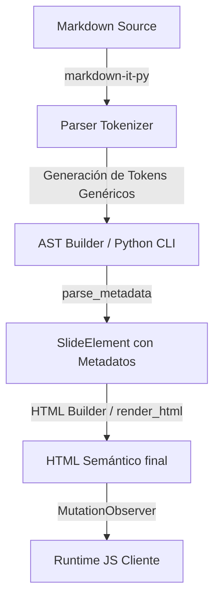

# Guía de Desarrollo de Plugins (docs/plugins.md)

**Versión:** 1.0  
**Audiencia:** Desarrolladores Core y Contribuidores del Motor  
**Ecosistema:** PresentMD Extensibility Pipeline

Este documento sirve como la especificación técnica definitiva y manual de desarrollo para extender el motor de presentaciones de PresentMD. Explica detalladamente cómo integrar nuevos componentes, interactuar con el árbol de sintaxis abstracta (AST) de `markdown-it-py`, registrar componentes en el `ComponentRegistry` y escribir código compatible con el runtime de cliente y el sistema de temas.

---

## 1. Arquitectura del Sistema de Plugins

PresentMD sigue una filosofía de **desacoplamiento estricto** entre la sintaxis fuente, la representación interna de datos y la visualización estética. La arquitectura de extensibilidad opera a través de un ciclo de vida lineal de compilación dividido en tres fases principales:



### Ciclo de Vida del Parsing y Renderizado de Componentes
1. **Fase de Tokenización (Parser):**
   * El parser central (`markdown-it-py`) utiliza un plugin de bloque genérico (`container_plugin` en `src/presentmd/parser/plugins.py`) que intercepta bloques delimitados por tres o más dos puntos (`:::`).
   * Al detectar la firma `:::nombre-componente{atributos}`, el tokenizador del parser crea tres tokens genéricos en la lista plana:
     * `container_nombre-componente_open` (que transporta los atributos inline).
     * `container_nombre-componente_body` (que transporta el texto crudo del interior).
     * `container_nombre-componente_close`.
2. **Fase de Construcción del AST (AST Builder):**
   * El builder (`ast_builder.py`) agrupa los tokens planos en instancias lógicas de `SlideElement`.
   * Al procesar un token `open`, busca en el registro global `component_registry` si existe un plugin para el nombre de componente dado.
   * Si existe, delega el parsing del cuerpo del texto al método `parse_metadata(content, attrs)` del plugin. Esto permite que el plugin deserialice su estructura interna de datos en un diccionario fuertemente estructurado.
   * El elemento resultante se guarda en el AST con el tipo `container_nombre-componente` y los metadatos generados.
3. **Fase de Generación HTML (HTML Builder):**
   * Durante el ensamblado final (`html_builder.py`), al procesar un `SlideElement` cuyo tipo comience con `container_`, se consulta nuevamente el `component_registry`.
   * Se invoca el método `render_html(content, metadata, render_inline)` del plugin, devolviendo HTML5 semántico puro que es inyectado directamente en la diapositiva activa.

---

## 2. El Registro Central (`ComponentRegistry`)

El punto de coordinación de todas las extensiones es la clase `ComponentRegistry` (`src/presentmd/plugins/registry.py`). Esta clase almacena y despacha los plugins activos bajo demanda.

### La Interfaz Protocolo `ComponentPlugin`
Para que una clase sea considerada un plugin válido por el cargador dinámico, debe cumplir con el protocolo `ComponentPlugin` definido en `registry.py`:

```python
from typing import Protocol, Dict, Any

class ComponentPlugin(Protocol):
    @property
    def name(self) -> str:
        """Retorna el identificador único del contenedor (ej. 'kpi-grid')."""
        ...

    def parse_metadata(self, content: str, attrs: Dict[str, Any]) -> Dict[str, Any]:
        """
        Procesa el contenido de texto plano interno del contenedor y sus atributos
        para devolver un diccionario estructurado de datos de negocio.
        """
        ...

    def render_html(self, content: str, metadata: Dict[str, Any], render_inline: callable) -> str:
        """
        Genera la representación en formato HTML5 utilizando los metadatos previamente
        parseados y un callback para renderizar markdown inline interno si es necesario.
        """
        ...
```

### Auto-Descubrimiento y Carga de Plugins
El motor implementa un mecanismo de descubrimiento reflexivo en `registry.py` mediante el método `discover_plugins()`:

```python
def discover_plugins():
    import importlib
    import pkgutil
    import inspect
    from presentmd.plugins import components
    
    for _, module_name, _ in pkgutil.iter_modules(components.__path__):
        try:
            module = importlib.import_module(f"presentmd.plugins.components.{module_name}")
            for attr_name in dir(module):
                attr = getattr(module, attr_name)
                if (
                    inspect.isclass(attr)
                    and hasattr(attr, "name")
                    and hasattr(attr, "render_html")
                    and attr.__name__ not in ("ComponentPlugin", "ComponentRegistry")
                ):
                    component_registry.register(attr())
        except Exception:
            pass
```

### Reglas y Validación de Registro (Prevención de Colisiones)
* **Namespace Único:** Los plugins se registran en un diccionario asociativo indexados por su propiedad `.name`.
* **Políticas de Sobrescritura:** Si se registra un plugin con un nombre ya existente, este sobrescribe de forma silenciosa la implementación anterior. Esto permite a los desarrolladores reemplazar componentes nativos por implementaciones personalizadas simplemente registrando su clase después de la inicialización de los componentes core.
* **Validación de Identificadores:** El nombre del plugin debe usar estrictamente caracteres alfanuméricos en minúsculas y guiones (ej. `kpi-grid`, `custom-card`). No se permiten espacios ni caracteres especiales, ya que romperían las reglas de coincidencia del motor de expresiones regulares del tokenizer.

---

## 3. Cómo Extender el Parser (`markdown-it-py`)

Si bien el parser cuenta con una regla genérica para bloques contenedores (`:::`), a veces es necesario extender o entender cómo interceptar y tokenizar la sintaxis.

El plugin de bloque `container_plugin` de `plugins.py` registra una regla dentro del pipeline de bloques de `markdown-it-py` bajo el nombre `presentmd_container`. 

### Procesamiento de Argumentos y Atributos Inline
Las expresiones regulares del tokenizer capturan atributos declarados dentro de llaves inmediatamente después del nombre del componente:

```markdown
:::custom-card{variant="premium" columns=3 border="false"}
```

El parser interno ejecuta la función `_parse_container_attrs` que procesa estas declaraciones mediante expresiones regulares tolerantes al formato:

```python
import re

def _parse_container_attrs(attrs_raw: str) -> dict:
    if not attrs_raw:
        return {}
    result = {}
    # Captura tres patrones: key="value", key='value' y key=value sin comillas
    for m in re.finditer(r"""([\w-]+)\s*=\s*"([^"]*)"|\'([^\']*)\'|([\w-]+)\s*=\s*([\w-]+)""", attrs_raw):
        groups = m.groups()
        if groups[0] and groups[1] is not None:
            result[groups[0]] = groups[1]
        elif groups[2] is not None:
            result[groups[2]] = groups[3]
        elif groups[4]:
            result[groups[4]] = groups[5]
    return result
```

Esto mapea los atributos directamente en el diccionario de configuración del token `open.meta["attrs"]`, facilitando su consumo en las funciones del plugin.

---

## 4. Guía de Implementación Práctica (Paso a Paso)

A continuación se desarrolla de extremo a extremo un nuevo componente llamado `:::metric-card` que permite renderizar una métrica visual destacada con formato opcional de pasos.

### Paso 1: Crear el archivo del Componente
Crea el archivo `src/presentmd/plugins/components/metric_card.py`. El sistema lo cargará automáticamente en el próximo arranque gracias al método `discover_plugins`.

```python
import re
from html import escape
from typing import Dict, Any

class MetricCardComponent:
    @property
    def name(self) -> str:
        # Define el identificador para la sintaxis :::metric-card
        return "metric-card"

    def parse_metadata(self, content: str, attrs: Dict[str, Any]) -> Dict[str, Any]:
        """
        Recibe el contenido crudo:
        - **Label**: Valor
        - Status: Critical
        Y lo procesa en un diccionario limpio.
        """
        metadata = {
            "title": attrs.get("title", "Métrica"),
            "color": attrs.get("color", "primary"),
            "steps": attrs.get("steps", "false") == "true",
            "metrics": []
        }
        
        # Analizar líneas internas con regex
        line_re = re.compile(r"^\-\s*(.+?):\s*(.+)$")
        for line in content.strip().splitlines():
            line_str = line.strip()
            if not line_str:
                continue
            match = line_re.match(line_str)
            if match:
                label = match.group(1).strip()
                val = match.group(2).strip()
                # Extraer estados opcionales en línea si existen
                status = "default"
                if "{" in val:
                    val_part, opt_part = val.split("{", 1)
                    val = val_part.strip()
                    if "status:" in opt_part:
                        status_match = re.search(r"status:\s*(\w+)", opt_part)
                        if status_match:
                            status = status_match.group(1)
                
                metadata["metrics"].append({
                    "label": label,
                    "value": val,
                    "status": status
                })
        return metadata

    def render_html(self, content: str, metadata: Dict[str, Any], render_inline: callable) -> str:
        """Genera el árbol DOM semántico y delega el markdown interno."""
        title = escape(metadata.get("title", ""))
        color = escape(metadata.get("color", "primary"))
        steps = metadata.get("steps", False)
        
        html = []
        html.append(f'<div class="metric-container" data-color="{color}">')
        html.append(f'  <h4 class="metric-group-title">{title}</h4>')
        html.append('  <div class="metric-wrapper">')
        
        for idx, metric in enumerate(metadata.get("metrics", [])):
            step_attr = ' data-step' if steps else ''
            step_class = ' step-hidden' if steps else ''
            status = escape(metric["status"])
            
            html.append(
                f'    <div class="metric-card{step_class}"{step_attr} data-status="{status}">'
                f'      <div class="metric-value">{escape(metric["value"])}</div>'
                f'      <div class="metric-label">{render_inline(metric["label"])}</div>'
                f'    </div>'
            )
            
        html.append('  </div>')
        html.append('</div>')
        return "\n".join(html)
```

### Paso 2: Uso del Componente en Markdown
El creador de la presentación puede invocar este componente mediante la siguiente declaración:

```markdown
:::metric-card{title="Desempeño Core" color="2" steps="true"}
- Tasa de Respuesta: 98.4% {status: success}
- Latencia Promedio: 240ms {status: warning}
:::
```

---

## 5. Interacción con el Runtime y los Temas (CSS/JS)

Para asegurar que un componente recién creado no rompa las animaciones o la maquetación visual de los temas de PresentMD, se deben seguir directrices estrictas sobre atributos de datos y clases.

### Integración con el Sistema de Animación Sub-Pasos (Steps)
El runtime JavaScript (`base.html.j2`) utiliza un `MutationObserver` y colecciona elementos con el atributo `data-step`. 
* Si tu componente admite secuenciación (`steps="true"`), cada hijo que deba revelarse de forma escalonada debe emitir:
  1. El atributo de marcado `data-step`.
  2. La clase inicial de ocultación `.step-hidden`.
* El runtime se encargará de remover la clase `.step-hidden` y reemplazarla por `.step-visible` de manera secuencial en respuesta a los eventos de avance del presentador.

### Separación de Estilos y Consumo de Tokens del Tema
* **No inyectar estilos en línea (inline CSS):** Evita asignar colores, rellenos o fuentes mediante atributos `style="..."` directamente en el generador Python, a menos que se trate de cálculos numéricos dinámicos (como el ancho de una barra de progreso o la rotación de un elemento circular).
* **Usar variables compartidas:** Diseña el marcado HTML del plugin para utilizar las clases cromáticas universales y variables CSS de los temas:
  * Utiliza `data-color="X"` en los contenedores raíz del componente para que el CSS del tema asigne dinámicamente el color activo (`--ui-color`).
  * Utiliza los nombres de clases semánticos estructurados (ej. `.metric-value`, `.metric-label`) para delegar el control de márgenes, tipografías y bordes directamente a la hoja de estilo `styles.css` del tema.

---

## 6. Estrategia de Pruebas (Testing de Plugins)

PresentMD promueve las pruebas unitarias aisladas sin necesidad de instanciar el servidor local o la interfaz de comandos completa. Esto se logra probando de forma directa las etapas de parsing y renderizado.

### Plantilla de Prueba con `pytest`
Crea un archivo de pruebas en el directorio de test `tests/test_metric_card.py` para validar tu componente:

```python
from presentmd.parser.models import Slide
from presentmd.parser.ast_builder import build_slide_ast
from presentmd.render.html_builder import render_element

def test_metric_card_parsing_and_rendering():
    # 1. Entrada Markdown cruda del componente
    raw_markdown = """\
:::metric-card{title="Test Metrics" color="3" steps="true"}
- Cobertura: 85% {status: critical}
:::
"""
    # 2. Construir objeto Slide y compilar AST
    slide = Slide(index=0, raw_content=raw_markdown)
    build_slide_ast(slide)
    
    # 3. Validar que el AST inyectó el tipo de elemento correcto
    metric_elements = [el for el in slide.elements if el.type == "container_metric-card"]
    assert len(metric_elements) == 1
    
    element = metric_elements[0]
    assert element.metadata["title"] == "Test Metrics"
    assert element.metadata["color"] == "3"
    assert element.metadata["steps"] is True
    assert len(element.metadata["metrics"]) == 1
    assert element.metadata["metrics"][0]["value"] == "85%"
    assert element.metadata["metrics"][0]["status"] == "critical"
    
    # 4. Validar el renderizado HTML
    html_output = render_element(element)
    assert '<div class="metric-container" data-color="3">' in html_output
    assert 'class="metric-card step-hidden"' in html_output
    assert 'data-step' in html_output
    assert 'data-status="critical"' in html_output
    assert '85%' in html_output
```

Ejecuta las pruebas en tu consola local asegurando la inclusión del path de código:
```bash
PYTHONPATH=src .venv/bin/pytest tests/test_metric_card.py
```
