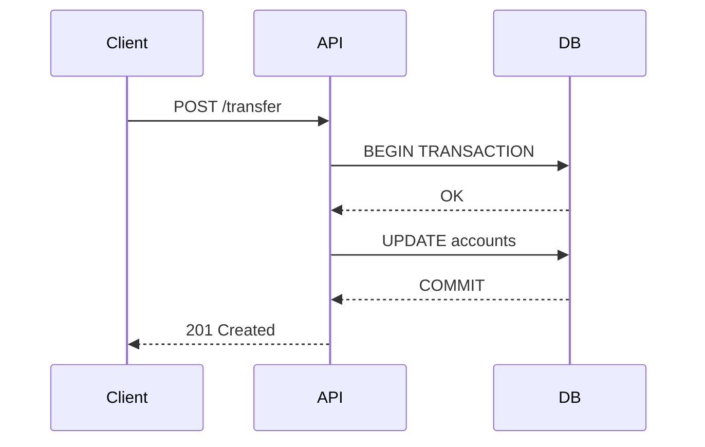

# Bienvenida a PresentMD

El sistema de presentaciones técnicas generado desde Markdown. Creado por la IA

---

::layout{standard}
::bg-image{src="blueprint_bg.png" opacity="0.25"}

## Panorama General y Fondos Inmersivos

Este slide demuestra la integración de un ==fondo inmersivo blueprint== con opacidad controlada.

* Podemos resaltar ideas con un ==resaltado de texto natural== para focalizar la atención.
* El menú lateral se activa al pasar el cursor por el borde izquierdo (**18px**).
* Presiona la tecla `f` o `F` para activar el modo pantalla completa.

:::notes
Esta es una nota de orador estructurada dentro de un contenedor `:::notes`.
Permite detallar anotaciones sin contaminar visualmente la lámina.
:::

---

::layout{split-comparison}

## Comparativa: SQL Server vs PostgreSQL

**Ventajas SQL Server:**
- Integración nativa con Azure
- Soporte corporativo Microsoft

|||

**Ventajas PostgreSQL:**
- Open source, sin licencia
- Extensibilidad con plugins

---

## Métricas del Proyecto

:::kpi-grid
- [55,424M] Registros totales {status: critical}
- [13 TB] Exportación estimada
- [14] Tablas migradas
- [18 meses] Horizonte de datos {status: amber}
:::

---

## Alerta de Fase Crítica

:::alert{type="red" icon="⚠️"}
**FASE 1:** La data se encuentra tokenizada. Se requiere un proceso de destokenización masiva antes de continuar con la migración.
:::

## Progreso de Migración

:::progress-bars
- P1 · Ene-Mar: 73%
- P2 · Abr-Jun: 45%
- P7 · Sep-Dic: 100% {color: secondary}
- P8 · Oct-May: 100% {color: secondary}
:::

---

## Modelo de Datos (SQL con Code Stepping)

```sql {1 | 4 | 5}
SELECT rut, nombre, monto
FROM clientes
WHERE estado = 'ACTIVO'
  AND region IN ('RM', 'V')
ORDER BY monto DESC;
```

Las líneas 1, 4 y 5 se resaltan paso a paso durante la presentación.

---

## Arquitectura del Sistema (D2 - Ejemplo 1)

```d2
Origen: {
  shape: cylinder
  label: "Base Origen"
}
ETL: {
  shape: hexagon
  label: "Pipeline ETL"
}
Staging: {
  shape: cylinder
  label: "Staging Area"
}
DWH: {
  shape: cylinder
  label: "Data Warehouse"
}

Origen -> ETL -> Staging -> DWH
DWH -> Reportes
DWH -> "API REST"
```

---

## Detalle de Microservicios (D2 - Ejemplo 2)

```d2
x-axis: 4
y-axis: 4

Usuario -> "API Gateway" {
  style.stroke: "#C8006B"
}

"API Gateway" -> "Servicio Autenticación"
"API Gateway" -> "Servicio Pagos"
"API Gateway" -> "Servicio Reportes"

"Servicio Pagos" -> "Base de Datos Redis" {
  style.animated: true
}
```

---

## Flujo de Transacciones (Mermaid)



---

## Grilla de Información Técnica

:::info-grid
- Formato de Datos: Apache Parquet (almacenamiento columnar optimizado) acceda al [Anexo de Costos](#anexo-costos){.link-anexo}.
- Transporte: AWS S3 (bucket dedicado cifrado con KMS)porque no se ve mi cambio?
- Frecuencia: Batch diario (ventanas de mantenimiento 02:00 - 04:00)
- Control de Calidad: Validaciones de esquema estricto de entrada
:::

---

## Roadmap de Migración (Timeline)

:::timeline
- **Fase 1 · Preparalelo**: Carga de Historia
  - ETL Evertec ejecutado en AWS Glue
  > Historia de 18 meses migrada y validada en DWH
- **Fase 2 · Paralelo**: Validación Shadow
  - Pay Studio procesando transacciones en paralelo
  - Reconciliación automatizada de saldos diarios
  > Conciliación con margen de error de 0.00%
- **Fase 3 · Switchover**: Paso a Producción
  - Apagado gradual de Base24 legacy
  > Pay Studio como sistema core de transacciones
:::

---

## Arquitectura de Transiciones

:::parallel-compare{center-badge="MIGRACIÓN"}
### Productivo (Legacy)
- Core Base24 sobre HP NonStop
- Base de datos relacional transaccional
- Conectores directos ISO 8583

---

### Shadow (Nuevo)
- Pay Studio microservicios en Kubernetes
- Base de datos distribuida de alta disponibilidad
- API Gateway REST con autenticación mTLS
:::

---

::layout{scrollable}

## Vista General del Presupuesto

Este slide detalla los recursos financieros asignados para el proyecto.

Para obtener el desglose detallado de los montos y servicios, acceda al [Anexo de Costos](#anexo-costos){.link-anexo}.

| Fase | Descripción | Presupuesto Asignado |
|------|-------------|----------------------|
| Fase 1 | Migración de Datos y AWS Glue | $45,000 USD |
| Fase 2 | Validación y Pruebas Shadow | $30,000 USD |
| Fase 3 | Switchover y Soporte Inicial | $25,000 USD |

<!-- notes -->
Explicar por qué la Fase 1 es la más costosa debido a la des-tokenización.
Recordar mencionar el SLA de 99.9% durante esta sección.
<!-- /notes -->

---

::layout{annex}

## Anexo de Costos {#anexo-costos}

Este es un anexo detallado del presupuesto del proyecto. No se puede acceder navegando secuencialmente (flechas o teclado), sino que requiere hacer clic en el link del slide anterior.

| Ítem | Proveedor / Recurso | Tarifa Mensual | Costo Anual Estimado |
|------|---------------------|----------------|----------------------|
| Licencias Cloud | AWS Cloud (S3, Glue, RDS) | $3,500 USD | $42,000 USD |
| Seguridad | AWS KMS & CloudTrail | $500 USD | $6,000 USD |
| Consultoría | Devs Senior Backend / Cloud | $8,000 USD | $96,000 USD |
| Infraestructura | Kubernetes Engine (EKS) | $1,200 USD | $14,400 USD |
| Redes y CDN | AWS CloudFront / Transit Gateway | $800 USD | $9,600 USD |


---

::layout{standard}

## Aparición Secuencial de Listas

:::steps
- **Paso 1:** Registrar un nuevo usuario en la base de datos distribuida.
- **Paso 2:** Generar un token único y enviar un correo electrónico de verificación.
- **Paso 3:** Redirigir al panel principal con la sesión activa de forma segura.
:::

---

::layout{standard}

## Imágenes en Capas Secuenciales

:::layer-stack


:::

---

::layout{standard}

## Transiciones Mágicas de Código

```python {1|2-3|all}
def procesar_transaccion(monto, cliente):
    # Paso 1: Validar saldo del cliente
    saldo = Db.obtener_saldo(cliente)
    if saldo < monto:
        raise ValueError("Saldo insuficiente")
    # Paso 2: Registrar débito y crédito
    Db.descontar(cliente, monto)
```

Las transiciones permiten enfocar la atención del presentador línea por línea.

---

::layout{standard}

## Anclas de Explicación y Pines (Hotspots)

:::hotspots{image="blueprint_bg.png"}
- [25%, 35%] **Filtro de Entrada**: Limpia las tramas corruptas recibidas de ISO 8583.
- [55%, 60%] **Transformación ETL**: Convierte el formato propietario a JSON estructurado.
- [80%, 40%] **Carga AWS Glue**: Inserta los registros en caliente en el Data Warehouse.
:::

---

::layout{standard}

## Foco Magnético (Spotlight)

:::spotlight
- [#db-origen] **Base de Datos**: Repositorio relacional legacy.
- [#api-gate] **API Gateway**: Portal de autenticación y ruteo.
:::

:::info-grid
- <span id="db-origen" style="display:inline-block; padding:4px;">Base de Datos</span>: PostgreSQL 15 con replicación activa.
- <span id="api-gate" style="display:inline-block; padding:4px;">API Gateway</span>: Kong Gateway configurado con mTLS.
- Balanceador: AWS ALB distribuyendo tráfico por zonas.
- Seguridad: AWS WAF bloqueando accesos no autorizados.
:::

---

::layout{standard}

## Herramientas de Presentador en Vivo

Esta lámina demuestra las herramientas interactivas disponibles para el presentador:

* **Puntero Láser**: Presione la tecla `l` o `L` para activar un puntero rojo que sigue el cursor del mouse.
* **Herramienta de Dibujo**:
  - Presione la tecla `d` o `D` (o haga clic en el botón `✏️` en la barra inferior) para activar el modo dibujo.
  - Arrastre el mouse o use la pantalla táctil para dibujar anotaciones directamente sobre la presentación.
  - Presione la tecla `c` o `C` (o el botón `🧹`) para limpiar todos los dibujos realizados.

---

::layout{standard}

## Arquitectura de Alta Densidad (Cards)

::::cards{cols="2"}
::card{title="The Common Pattern" icon="⚠️" color="red"}
- **Development**: Preparing new datasets
- **Training**: Fine-tuning load with transformers
::
::card{title="The Dataset Solution" icon="⚙️" color="green"}
- Single Environment, Multiple Contexts
- Automatic dependency resolution
::
::::

---

::layout{standard}

## Grilla de Características Rápidas (Feature Grid)

:::feature-grid{cols="4"}
- [💻] **ABI Incompatibility** {color: yellow}
- [🖧] **CUDA Version Conflicts** {color: green}
- [📦] **System Library Conflicts** {color: slate}
- [✖️] **Package Inconsistencies** {color: blue}
:::

---

::layout{standard}

## Alerta Estratégica (Layout Horizontal)

:::alert{title="Real World Impact" icon="⚠️" type="red" layout="horizontal"}
- ⏱️ Hours wasted reinstalling CUDA
- 📉 Inconsistent model results
- 💥 Broken production deployments
:::

---

::layout{standard}

## Auto-Escalado Autónomo (Fit-to-Screen)

Esta lámina tiene demasiado contenido y normalmente desbordaría el alto máximo de **720px**, rompiendo el diseño:

* **Elemento de Prueba 1**: Configuración de red del VPC.
* **Elemento de Prueba 2**: Políticas de cifrado KMS.
* **Elemento de Prueba 3**: Tiempos de retención de S3.
* **Elemento de Prueba 4**: Esquemas de replicación RDS.
* **Elemento de Prueba 5**: Parámetros del grupo de seguridad.
* **Elemento de Prueba 6**: Escalado automático de EKS.
* **Elemento de Prueba 7**: Configuración de CloudWatch Logs.
* **Elemento de Prueba 8**: Reglas de enrutamiento de Route 53.
* **Elemento de Prueba 9**: Certificados SSL/TLS de ACM.
* **Elemento de Prueba 10**: Distribución de caché CloudFront.
* **Elemento de Prueba 11**: Funciones Lambda de auditoría.
* **Elemento de Prueba 12**: Destinos de entrega Kinesis.
* **Elemento de Prueba 13**: Políticas IAM de menor privilegio.
* **Elemento de Prueba 14**: Métrica de consumo billing.
* **Elemento de Prueba 15**: Alertas críticas SNS de error.
* **Elemento de Prueba 16**: Respaldos cruzados de base de datos.
* **Elemento de Prueba 17**: Limpieza de imágenes ECR viejas.

El sistema detecta automáticamente este desbordamiento y reduce dinámicamente el tamaño de fuente (font-size) de esta diapositiva específica para que quepa perfectamente.

---

::layout{standard}

## Conclusión y Próximos Pasos {#conclusion}

Aquí finaliza la presentación principal del proyecto.

- Inicio de la Fase 1 programada para el Q3.
- Monitoreo en paralelo durante el Q4.
- Cierre del proyecto e informe final del Milestone 4.

¡Muchas gracias por su atención!


