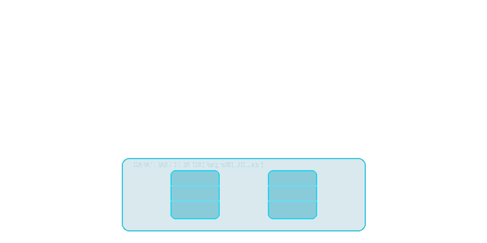
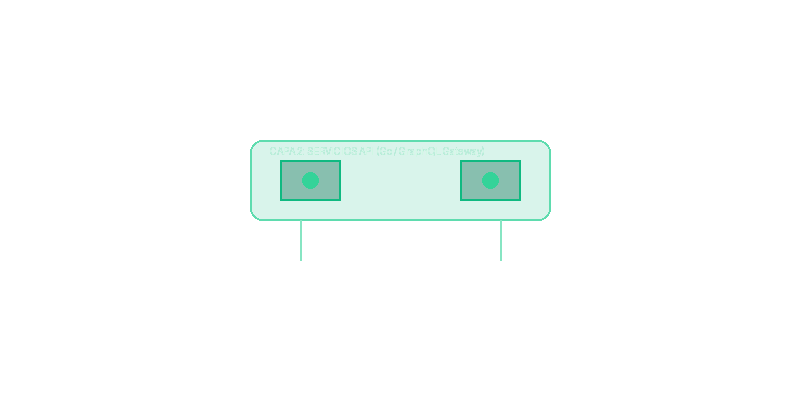
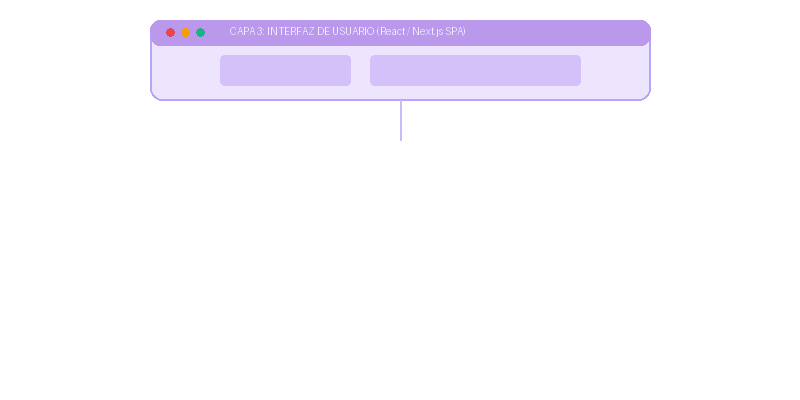
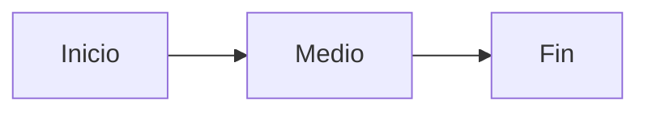

::layout{title}
# PresentMD
## Showcase de Todas las Funcionalidades

Presiona la barra espaciadora para avanzar y descubrir cada componente.

---

::layout{standard}
## 1. Directivas de Layout y Texto Inline (Visual)

El layout `standard` se ajusta a una diapositiva centrada tradicional. PresentMD permite enriquecer el texto directamente en Markdown:

*   **Estilos Básicos**: Texto en **negrita**, *cursiva*, y ==resaltado brillante==.
*   **Elementos Inline**: [BADGES]{.badge.c-3} para etiquetas, y estados inline de alerta como [CRÍTICO]{.badge.c-6} o [OK]{.badge.c-4}.
*   **Hipervínculos a Anexos**: [Ir al Anexo de Layout Scrollable](#anexo-scroll){.link-anexo}

---

## 1. Directivas de Layout y Texto Inline (Código)

Se definen utilizando clases nativas encerradas en llaves `{}` inmediatamente después del corchete:

```markdown {3|4|5|all}
*   **Estilos Básicos**: Texto en **negrita**, *cursiva*, y ==resaltado brillante==.
*   **Elementos Inline**: [BADGES]{.badge .c-3} para etiquetas.
*   **Estados Inline**: [CRÍTICO]{.badge .c-6} o [OK]{.badge .c-4}.
*   **Hipervínculos a Anexos**: [Ir al Anexo](#anexo-scroll){.link-anexo}
```

---

::bg-image{src="logotbk.jpg" opacity="0.1"}
## 2. Fondo de Imagen (Visual)

La directiva `::bg-image` coloca una imagen de fondo en la diapositiva con opacidad controlable.

*   **Uso**: Permite marcas de agua, logotipos o fondos de marca con total control de visibilidad.
*   **Nota**: Soporta formatos locales y remotos resolviendo Data URIs automáticamente.

:::notes
Estas son notas del presentador para esta diapositiva y no se muestran en pantalla.
:::

---

## 2. Fondo de Imagen (Código)

La sintaxis utiliza doble dos puntos (`::`) al inicio de la diapositiva:

```markdown {1|2|all}
::bg-image{src="logotbk.jpg" opacity="0.1"}
## 2. Fondo de Imagen (Visual)
```

---

## 3. KPI Grid (Visual)

El componente `:::kpi-grid` organiza métricas ejecutivas clave en una cuadrícula auto-ajustable con indicadores visuales de estado.

:::kpi-grid
- [10,000] Consultas/seg {status: "4"}
- [45ms] Latencia Media {status: "3"}
- [2] Nodos Caídos {status: "6"}
- [99.9%] Uptime Global
:::

---

## 3. KPI Grid (Código)

Define una lista con valores numéricos entre corchetes `[]` y parámetros de estado opcionales:

```markdown {1,6|2|3|4|all}
:::kpi-grid
- [10,000] Consultas/seg {status: "4"}
- [45ms] Latencia Media {status: "3"}
- [2] Nodos Caídos {status: "6"}
- [99.9%] Uptime Global
:::
```

---

## 4. Alert Boxes (Visual)

Las cajas de alerta `:::alert` destacan advertencias o advertencias informativas importantes. Pueden estructurarse horizontal o verticalmente.

:::alert{type="1" icon="ℹ️" layout="vertical"}
**Alerta Vertical (Información):**
Ideal para explicaciones largas o bloques de notas importantes.
:::

:::alert{type="6" icon="⚠️" layout="horizontal"}
- **Alerta Horizontal (Peligro):** Entrada 1
- **Estado Crítico:** Entrada 2
:::

---

## 4. Alert Boxes (Código)

Configura el tipo (`blue`, `red`, `amber`, `green`), el icono y el tipo de layout en los atributos:

```markdown {1-4|6-9|all}
:::alert{type="1" icon="ℹ️" layout="vertical"}
**Alerta Vertical (Información):**
Ideal para explicaciones largas o bloques de notas importantes.
:::

:::alert{type="6" icon="⚠️" layout="horizontal"}
- **Alerta Horizontal (Peligro):** Entrada 1
- **Estado Crítico:** Entrada 2
:::
```

---

## 5. Progress Bars y Blockquotes (Visual)

Las barras de progreso `:::progress-bars` muestran visualmente el avance de tareas en el roadmap. Las citas nativas `>` se tematizan automáticamente.

:::progress-bars
- Migración Frontend: 80% {color: "1"}
- DevOps: 100% {color: "4"}
:::

> "Las barras de progreso y citas enriquecen visualmente las retrospectivas de sprint."

---

## 5. Progress Bars y Blockquotes (Código)

Define porcentajes numéricos y colores temáticos en las barras de progreso, y usa la sintaxis estándar de citas de Markdown:

```markdown {1-4|6-7|all}
:::progress-bars
- Migración Frontend: 80% {color: "1"}
- DevOps: 100% {color: "4"}
:::

> "Las barras de progreso y citas enriquecen..."
```

---

## 6. Info Grid (Visual)

El componente `:::info-grid` organiza pares de clave y valor en una cuadrícula compacta y ordenada, perfecto para especificaciones técnicas o parámetros.

:::info-grid
- Base de Datos: PostgreSQL 16
- Memoria Caché: Redis Cluster
- Orquestador: Kubernetes v1.28
- CI/CD Pipelines: GitHub Actions
:::

---

## 6. Info Grid (Código)

Utiliza una estructura de lista estándar con dos puntos `:` para separar la etiqueta del valor:

```markdown {1,6|2|3|4-5|all}
:::info-grid
- Base de Datos: PostgreSQL 16
- Memoria Caché: Redis Cluster
- Orquestador: Kubernetes v1.28
- CI/CD Pipelines: GitHub Actions
:::
```

---

## 7. Timeline (Visual)

El componente `:::timeline` es una forma visual y secuencial de listar hitos del proyecto, sub-tareas y citas breves vinculadas a cada hito.

:::timeline
- **Fase 1**: Análisis de Datos
  - Extraer información legacy
  > Documento de mapeo listo
- **Fase 2**: Migración
  - Desarrollo de ETLs en Python
  - Pruebas A/B
  > Migración Completada
:::

---

## 7. Timeline (Código)

Se anidan los elementos en listas ordenadas y se pueden incluir sub-citas con el prefijo `>`:

```markdown {1,9|2-4|5-8|all}
:::timeline
- **Fase 1**: Análisis de Datos
  - Extraer información legacy
  > Documento de mapeo listo
- **Fase 2**: Migración
  - Desarrollo de ETLs en Python
  - Pruebas A/B
  > Migración Completada
:::
```

---

::layout{split-comparison}
## 8. Parallel Compare (Visual)

El layout `split-comparison` combinado con `:::parallel-compare` divide la diapositiva verticalmente y muestra un badge en el centro para confrontar dos ideas o arquitecturas.

:::parallel-compare{center-badge="VS"}
### Arquitectura Legacy
- Monolito en Java
- Renderizado en Servidor
- XML Data
---
### Arquitectura Moderna
- Microservicios en Go
- SPA en React
- JSON REST
:::

---

## 8. Parallel Compare (Código)

El contenedor divide los bloques mediante tres guiones medios (`---`) en una estructura paralela:

```markdown {1,11|2-5|6|7-10|all}
:::parallel-compare{center-badge="VS"}
### Arquitectura Legacy
- Monolito en Java
- Renderizado en Servidor
- XML Data
---
### Arquitectura Moderna
- Microservicios en Go
- SPA en React
- JSON REST
:::
```

---

## 9. Cards - Tarjetas Modulares (Visual)

Las **Cards** (`:::cards`) son contenedores robustos para bloques enriquecidos de contenido. Soporta títulos, iconos, párrafos largos y listas anidadas.

:::cards{cols="2"}
::card{title="Rendimiento" icon="⚡" color="1"}
Máxima velocidad de carga. Soporta explicaciones detalladas y párrafos largos en cada tarjeta.
::
::card{title="Seguridad" icon="🔒" color="2"}
Encriptación End-to-End garantizada para transferencias de datos seguras.
::
:::

---

## 9. Cards - Tarjetas Modulares (Código)

Utiliza la directiva block `:::cards` y define bloques anidados `::card` especificando sus atributos:

```markdown {1,8|2-4|5-7|all}
:::cards{cols="2"}
::card{title="Rendimiento" icon="⚡" color="1"}
Máxima velocidad de carga. Soporta explicaciones...
::
::card{title="Seguridad" icon="🔒" color="2"}
Encriptación End-to-End garantizada...
::
:::
```

---

## 10. Feature Grid (Visual)

A diferencia de las Cards, el **Feature Grid** (`:::feature-grid`) es un componente compacto y ligero ideal para listas cortas con iconos y estados inline simples.

:::feature-grid{cols="2"}
- [☁️] Despliegue en la nube AWS {color: "1"}
- [📦] Contenedores Docker nativos {color: "2"}
- [🔧] Soporte de compilador CLI {color: "1"}
- [💾] Base de datos persistente {color: "4"}
:::

---

## 10. Feature Grid (Código)

Utiliza una lista de bullets simples donde el icono se encierra en corchetes `[]` al inicio del ítem:

```markdown {1,6|2|3|4-5|all}
:::feature-grid{cols="2"}
- [☁️] Despliegue en la nube AWS {color: "1"}
- [📦] Contenedores Docker nativos {color: "2"}
- [🔧] Soporte de compilador CLI {color: "1"}
- [💾] Base de datos persistente {color: "4"}
:::
```

---

## 11. Steps - Revelación Secuencial (Visual)

El contenedor `:::steps` oculta sus elementos hijos y los revela uno a uno secuencialmente cada vez que se avanza la presentación con el teclado.

:::steps
- **Paso 1**: Planificar el backend
- **Paso 2**: Implementar el motor de plantillas
- **Paso 3**: Desplegar el MVP en producción
:::

---

## 11. Steps - Revelación Secuencial (Código)

Simplemente envuelve una lista Markdown estándar dentro del bloque `:::steps`:

```markdown {1,5|2|3|4|all}
:::steps
- **Paso 1**: Planificar el backend
- **Paso 2**: Implementar el motor de plantillas
- **Paso 3**: Desplegar el MVP en producción
:::
```

---

## 12. Layer Stack (Visual)

El componente `:::layer-stack` superpone elementos (como imágenes transparentes) uno sobre otro en la misma posición tridimensional. Al avanzar la presentación, se revelan las capas progresivamente. Esto es ideal para ilustrar arquitecturas de software multicapa, evolución de diagramas de red o desarrollo paso a paso de mockups visuales.

:::layer-stack



:::

---

## 12. Layer Stack (Código)

Envuelve las imágenes en un bloque `:::layer-stack`. La primera imagen actúa como base y las subsiguientes se superponen secuencialmente:

```markdown {1,5|2|3|4|all}
:::layer-stack


:::
```

---

## 13. Code Stepping Mágico (Visual)

PresentMD resalta bloques de código con soporte dinámico para enfocar y avanzar entre líneas específicas mediante anotaciones de rangos de líneas.

```python {1|2-3|all}
def calcular_eficiencia(x):
    y = x * 100
    return y
```

---

## 13. Code Stepping Mágico (Código)

Especifica las reglas de pasos entre llaves en la definición del lenguaje del bloque de código:

```markdown
```python {1|2-3|all}
def calcular_eficiencia(x):
    y = x * 100
    return y
```
```

---

## 14. Hotspots - Puntos de Interés (Visual)

Coloca pines o anclas interactivas sobre una imagen base. Al hacer clic o hover en cada pin, se despliega información de contexto.

:::hotspots{image="logo.png"}
- [20%, 30%] **Pin 1**: Esquina superior izquierda del logotipo.
- [80%, 50%] **Pin 2**: Área central del isotipo de marca.
:::

[Ver Anexo de Spotlight](#anexo-spotlight){.link-anexo}

---

## 14. Hotspots - Puntos de Interés (Código)

Se define con las coordenadas relativas en porcentaje `[X%, Y%]` para la colocación exacta de los pines:

```markdown {1,4|2|3|all}
:::hotspots{image="logo.png"}
- [20%, 30%] **Pin 1**: Esquina superior izquierda del logotipo.
- [80%, 50%] **Pin 2**: Área central del isotipo de marca.
:::
```

---

## 15. Diagramas Mermaid Nativos (Visual)

Mermaid se procesa directamente en el cliente de forma nativa para dibujar diagramas de flujo, diagramas de secuencia y flujos de arquitectura sin dependencias pesadas.



[Ver Anexo Tablas](#anexo-tablas){.link-anexo}

---

## 15. Diagramas Mermaid Nativos (Código)

Se escriben utilizando bloques de código estándar especificando el lenguaje `mermaid`:

````markdown

````

---

## 16. SmartArt: Process Flow (Paso a Paso)

Muestra una secuencia de pasos en forma de chevrón continuo con animación secuencial paso a paso al avanzar.

:::process-flow{steps="true"}
- [Ideación] Definir visión y alcance {icon: "💡", color: "1"}
- [Plan] Asignar sprints y recursos {text: "Plan", color: "2"}
- [Desarrollo] Codificación "Zero-Framework" {text: "none", color: "1"}
- [Lanzamiento] Lanzamiento oficial al mercado {icon: "🚀", color: "4"}
:::

---

## 16. SmartArt: Process Flow (Todo de una vez)

El mismo componente se puede configurar para renderizarse completamente visible desde el primer instante:

:::process-flow
- [Ideación] Definir visión y alcance {icon: "💡", color: "1"}
- [Plan] Asignar sprints y recursos {text: "Plan", color: "2"}
- [Desarrollo] Codificación "Zero-Framework" {text: "none", color: "1"}
- [Lanzamiento] Lanzamiento oficial al mercado {icon: "🚀", color: "4"}
:::

---

## 16. SmartArt: Process Flow (Código)

Usa la directiva `:::process-flow` con el parámetro opcional `steps="true"` para activar la animación secuencial:

```markdown {1|6|all}
:::process-flow{steps="true"}
- [Ideación] Definir visión y alcance {icon: "💡", color: "1"}
...
:::

:::process-flow
- [Ideación] Definir visión y alcance {icon: "💡", color: "1"}
...
:::
```

---

## 17. SmartArt: Pyramid (Paso a Paso)

Recorta una lista vertical en forma de pirámide jerárquica con animación secuencial paso a paso al avanzar. La punta de la pirámide tiene márgenes dinámicos para evitar cortes en el texto.

:::pyramid{steps="true"}
- [Estrategia] Definir visión de producto {text: "Nivel 1", color: "1"}
- [Planificación] Priorizar el backlog {text: "Nivel 2", color: "2"}
- [Desarrollo] Codificación ágil del MVP {text: "Nivel 3", color: "4"}
:::

---

## 17. SmartArt: Pyramid (Todo de una vez)

Muestra toda la pirámide de capas de forma estática en pantalla desde el principio:

:::pyramid
- [Estrategia] Definir visión de producto {text: "Nivel 1", color: "1"}
- [Planificación] Priorizar el backlog {text: "Nivel 2", color: "2"}
- [Desarrollo] Codificación ágil del MVP {text: "Nivel 3", color: "4"}
:::

---

## 17. SmartArt: Pyramid (Código)

Configura el bloque `:::pyramid` especificando `steps="true"` para la animación secuencial:

```markdown {1|6|all}
:::pyramid{steps="true"}
- [Estrategia] Definir visión de producto {text: "Nivel 1", color: "1"}
...
:::

:::pyramid
- [Estrategia] Definir visión de producto {text: "Nivel 1", color: "1"}
...
:::
```

---

## 18. Gráficos Nativos CSS: Bar Chart (Paso a Paso)

Genera gráficos de barras rápidas y fluidas basadas puramente en CSS, con animación secuencial paso a paso al presionar espacio.

:::bar-chart{title="Crecimiento Trimestral" steps="true"}
- [Q1] 45% {color: "1"}
- [Q2] 60% {color: "2"}
- [Q3] 75% {color: "1"}
- [Q4] 90% {color: "4"}
:::

---

## 18. Gráficos Nativos CSS: Bar Chart (Todo de una vez)

Muestra el gráfico de barras completamente visible en pantalla desde el inicio:

:::bar-chart{title="Crecimiento Trimestral"}
- [Q1] 45% {color: "1"}
- [Q2] 60% {color: "2"}
- [Q3] 75% {color: "1"}
- [Q4] 90% {color: "4"}
:::

---

## 18. Gráficos Nativos CSS: Bar Chart (Código)

Utiliza `:::bar-chart` y define la altura porcentual en el bloque de opciones del ítem:

```markdown {1|6|all}
:::bar-chart{title="Crecimiento Trimestral" steps="true"}
- [Q1] 45% {color: "1"}
...
:::

:::bar-chart{title="Crecimiento Trimestral"}
- [Q1] 45% {color: "1"}
...
:::
```

---

## 19. Gráficos Interactivos (Chart.js) (Visual)

Integra la biblioteca Chart.js de forma condicional para renderizar gráficos interactivos que heredan automáticamente los colores del tema activo.

:::chart{type="line" title="Rendimiento del Compilador (Transacciones por Segundo)"}
labels: ["Ene", "Feb", "Mar", "Abr", "May", "Jun"]
data: [1200, 1900, 3200, 5000, 7200, 9400]
colors: ["1", "2", "1", "2", "4", "4"]
:::

---

## 19. Gráficos Interactivos (Chart.js) (Código)

Los datos se definen utilizando una estructura YAML compacta de labels, data y colors:

```markdown {1|2|3|4|all}
:::chart{type="line" title="Rendimiento del Compilador"}
labels: ["Ene", "Feb", "Mar", "Abr", "May", "Jun"]
data: [1200, 1900, 3200, 5000, 7200, 9400]
colors: ["1", "2", "1", "2", "4", "4"]
:::
```

---

## 20. Bloque de Contador Animado (Visual)

El componente `:::animated-counter` genera una métrica destacada con animación de conteo al activarse la diapositiva.

:::animated-counter{from="0" to="9400" suffix=" IPS" title="Rendimiento de Procesamiento"}
:::

---

## 20. Bloque de Contador Animado (Código)

Especifica las propiedades del contador directamente en los atributos del bloque:

```markdown
:::animated-counter{from="0" to="9400" suffix=" IPS" title="Rendimiento de Procesamiento"}
:::
```

---

## 21. Paneles Interactivos - Tabs (Visual)

El contenedor `:::tabs` divide la información en múltiples paneles a los que se accede mediante pestañas superiores, ideal para organizar contenido técnico.

:::tabs
=== 💻 Cliente ===
- **Tecnología**: Vanilla JS & CSS Puro.
- **Renderizado**: Altamente responsivo, optimizado a 60fps.
- **Dependencias**: Cero frameworks pesados.
=== ⚙️ Servidor ===
- **Lenguaje**: Python 3.12.
- **Motor AST**: Markdown-it-py con extensiones personalizadas.
- **CLI**: Soporta `build`, `serve` (Live Reload) y `doctor`.
=== 📄 Documentación ===
- PresentMD está documentado con estándares de Clean Architecture.
- Cada componente cuenta con sus respectivos unit tests.
:::

---

## 21. Paneles Interactivos - Tabs (Código)

Divide las secciones de pestañas utilizando delimitadores con tres signos de igual `===`:

```markdown {1,11|2|3-5|6|7-9|all}
:::tabs
=== 💻 Cliente ===
- **Tecnología**: Vanilla JS & CSS Puro.
- **Renderizado**: Altamente responsivo...
- **Dependencias**: Cero frameworks...
=== ⚙️ Servidor ===
- **Lenguaje**: Python 3.12.
- **Motor AST**: Markdown-it-py con...
:::
```

---

## 22. Layouts Multicolumna - Grid (Visual)

El componente `:::grid` divide el espacio horizontal en columnas con anchos flexibles o fijos usando `::col`.

:::grid
::col{width="1/3"}
### Columna 1 (1/3)
Este bloque ocupa exactamente un tercio del espacio disponible.
::col{width="2/3"}
### Columna 2 (2/3)
Este bloque ocupa dos tercios. Muy útil para combinar texto explicativo largo con mini-paneles o imágenes.
:::

---

## 22. Layouts Multicolumna - Grid (Código)

Define columnas independientes usando `::col` y especifica su fracción o porcentaje de ancho:

```markdown
:::grid
::col{width="1/3"}
### Columna 1 (1/3)
Contenido de la primera columna.
::col{width="2/3"}
### Columna 2 (2/3)
Contenido de la segunda columna.
:::
```

---

## 23. Bloque de Contador Animado (Visual)

El componente `:::animated-counter` genera una métrica destacada con animación de conteo al activarse la diapositiva.

:::animated-counter{from="0" to="9400" suffix=" IPS" title="Rendimiento de Procesamiento"}
:::

---

## 23. Bloque de Contador Animado (Código)

Especifica las propiedades del contador directamente en los atributos del bloque:

```markdown
:::animated-counter{from="0" to="9400" suffix=" IPS" title="Rendimiento de Procesamiento"}
:::
```

---

## 24. Anillos de Progreso SVG (Visual)

El componente `:::progress-ring` renderiza un anillo de progreso circular SVG animado, ideal para métricas de conversión o KPI circulares.

:::grid
::col
:::progress-ring{value="75" size="140" stroke="10" color="1" title="Tasa de Cierre"}
:::
::
::col
:::progress-ring{value="92" size="140" stroke="10" color="4" title="Satisfacción"}
:::
::
::col
:::progress-ring{value="40" size="140" stroke="10" color="3" title="Uso CPU"}
:::
::
:::

---

## 24. Anillos de Progreso SVG (Código)

Se definen indicando el valor de `0` a `100`, el tamaño en píxeles y el grosor del borde:

```markdown
:::grid
::col
:::progress-ring{value="75" size="140" stroke="10" color="1" title="Tasa de Cierre"}
:::
::col
:::progress-ring{value="92" size="140" stroke="10" color="4" title="Satisfacción"}
:::
::col
:::progress-ring{value="40" size="140" stroke="10" color="3" title="Uso CPU"}
:::
:::
```

---

## 25. Efecto Typewriter (Visual)

El componente `:::typewriter` escribe el texto letra por letra simulando una máquina de escribir clásica cuando el slide se activa.

:::typewriter{speed="60" delay="300"}
Este texto se está redactando dinámicamente frente a tus ojos utilizando un temporizador Vanilla JS ligero y de alto rendimiento.
:::

---

## 25. Efecto Typewriter (Código)

Envuelve el texto en `:::typewriter` especificando la velocidad (ms por letra) y el retraso inicial:

```markdown
:::typewriter{speed="60" delay="300"}
Este texto se está redactando dinámicamente...
:::
```

---

## 26. Animación Secuencial Stagger (Visual)

El contenedor `:::fade-stagger` aplica un retraso secuencial progresivo automático en la aparición de sus elementos hijos.

:::fade-stagger{delay="150" speed="400"}
### 🌟 Elemento Uno
Aparición suave y fluida primero.

### 🚀 Elemento Dos
Aparición automática una fracción de segundo después.

### 🛡️ Elemento Tres
Aparición final completando la secuencia del grupo.
:::

---

## 26. Animación Secuencial Stagger (Código)

Envuelve los elementos y define el retraso (`delay`) y la velocidad (`speed`) en milisegundos:

```markdown
:::fade-stagger{delay="150" speed="400"}
### 🌟 Elemento Uno
...
### 🚀 Elemento Dos
...
:::
```

---

## 27. Bloques de Callout (Visual)

El componente `:::callout` genera cajas destacadas con bordes estilizados, iconos personalizados y soporte opcional para colapsar/desplegar.

:::callout{type="3" title="Advertencia Importante" icon="⚠️"}
Este bloque alerta al usuario sobre puntos críticos que no se deben ignorar.
:::

:::callout{type="5" title="Tip Profesional" icon="💡" collapsible="true"}
¡Este es un callout colapsable! Haz clic en el encabezado para expandir o contraer esta información complementaria.
:::

---

## 27. Bloques de Callout (Código)

Usa la directiva `:::callout` y configúrala con el tipo (`1` a `6`) e icono:

```markdown
:::callout{type="3" title="Advertencia Importante" icon="⚠️"}
Este bloque alerta al usuario sobre puntos críticos...
:::

:::callout{type="5" title="Tip Profesional" icon="💡" collapsible="true"}
¡Este es un callout colapsable!
:::
```

---

## 28. SmartArt: Radial Process (Paso a Paso)

Muestra un modelo de "Centro y Radios" con un título central y segmentos distribuidos equitativamente alrededor. Las tarjetas aparecen secuencialmente con animación.

:::radial-process{center-title="KOTTER'S 8-STEP MODEL" steps="true"}
- [STEP 01] Create a sense of urgency. {color: "3"}
- [STEP 02] Build a guiding coalition. {color: "1"}
- [STEP 03] Form a strategic vision. {color: "2"}
- [STEP 04] Enlist volunteers en masse. {color: "4"}
:::

---

## 28. SmartArt: Radial Process (Todo de una vez)

Muestra todos los segmentos y tarjetas visibles desde el inicio sin animación secuencial.

:::radial-process{center-title="KOTTER'S 8-STEP MODEL"}
- [STEP 01] Create a sense of urgency. {color: "3"}
- [STEP 02] Build a guiding coalition. {color: "1"}
- [STEP 03] Form a strategic vision. {color: "2"}
- [STEP 04] Enlist volunteers en masse. {color: "4"}
- [STEP 05] Enable action by removing barriers. {color: "1"}
- [STEP 06] Generate short-term wins. {color: "3"}
- [STEP 07] Sustain acceleration. {color: "2"}
- [STEP 08] Institute change. {color: "4"}
:::

---

## 28. SmartArt: Radial Process (Código)

Usa la directiva `:::radial-process` con el parámetro opcional `steps="true"` para la animación secuencial y `center-title` para el texto central.

```markdown {1,10|2-9|all}
:::radial-process{center-title="KOTTER'S 8-STEP MODEL" steps="true"}
- [STEP 01] Create a sense of urgency. {color: "3"}
- [STEP 02] Build a guiding coalition. {color: "1"}
...
:::
```

---

::layout{annex}
## Anexo 1: Layout Scrollable {#anexo-scroll}

Este es un layout scrollable. Puedes agregar mucho texto y se podrá hacer scroll de manera vertical.

Este es el párrafo número 1 de prueba para demostrar el comportamiento del layout scrollable. Al tener suficiente contenido vertical, este contenedor activa automáticamente una barra de desplazamiento lateral permitiendo al usuario leer toda la información sin romper el diseño de la diapositiva de 720px.

Este es el párrafo número 2 de prueba para demostrar el comportamiento del layout scrollable. Al tener suficiente contenido vertical, este contenedor activa automáticamente una barra de desplazamiento lateral permitiendo al usuario leer toda la información sin romper el diseño de la diapositiva de 720px.

Este es el párrafo número 3 de prueba para demostrar el comportamiento del layout scrollable. Al tener suficiente contenido vertical, este contenedor activa automáticamente una barra de desplazamiento lateral permitiendo al usuario leer toda la información sin romper el diseño de la diapositiva de 720px.

<button class="btn-volver">Volver al Showcase</button>

---

::layout{annex}
## Anexo 2: Demo de Spotlight {#anexo-spotlight}

Apunta la luz interactiva a elementos del DOM.

<div id="caja-destacada" style="padding:20px; background:var(--accent-primary); color:white; display:inline-block; margin:10px 0;">Caja a resaltar</div>
<div class="texto-destacado" style="margin-top:20px;">Texto a resaltar</div>

:::spotlight
- [#caja-destacada] Esta es una caja resaltada de forma exclusiva.
- [.texto-destacado] Este es un texto con clase.
:::

[Volver al Showcase](#){.btn-volver}

---

## 29. Premium Tables: Angled (Visual)

El componente `:::pmd-table` con `variant="angled"` pinta cada `<th>` con un color de la paleta de Design Tokens y aplica un corte diagonal derecho. Ideal para headers llamativos.

:::pmd-table{variant="angled" title="AWESOME TABLE" colors="1, 2, 3, 4" total-row="true"}
| Producto | Q1 | Q2 | Q3 | Q4 |
| --- | --- | --- | --- | --- |
| Alpha SaaS | $12,000 | $14,500 | $18,200 | $22,000 |
| Beta PaaS | $8,400 | $9,100 | $11,300 | $14,700 |
| Gamma IaaS | $5,200 | $6,800 | $7,500 | $9,300 |
| **TOTAL** | **$25,600** | **$30,400** | **$37,000** | **$46,000** |
:::

---

## 29. Premium Tables: Colored Columns (Visual)

:::pmd-table{variant="colored-cols" title="COLORED COLUMNS" colors="1, 2, 3"}
| Métrica | Objetivo | Actual | Varianza |
| --- | --- | --- | --- |
| Revenue | $50K | $54K | +8% |
| Usuarios | 10K | 10.8K | +8% |
| Conversión | 3.5% | 3.8% | +0.3pp |
:::

---

## 29. Premium Tables: Corporate (Visual)

:::pmd-table{variant="corporate" title="CORPORATE STYLE"}
| Departamento | Headcount | Presupuesto |
| --- | --- | --- |
| Ingeniería | 45 | $2.4M |
| Marketing | 12 | $800K |
| Operaciones | 28 | $1.1M |
| Ventas | 18 | $900K |
:::

---

## 29. Premium Tables: Ribbon (Visual)

:::pmd-table{variant="ribbon" title="RIBBON STYLE" colors="1, 2, 3, 4"}
| *** | Indicador | Valor |
| --- | --- | --- |
| Disponibilidad | Uptime Global | 99.97% |
| Rendimiento | Latencia Media | 42ms |
| Capacidad | Throughput Pico | 12K req/s |
| Calidad | Tasa de Error | 0.02% |
:::

---

## 29. Premium Tables (Código)

Cada variante se configura mediante atributos en la directiva `:::pmd-table`:

```markdown
:::pmd-table{variant="angled" title="AWESOME TABLE" colors="1, 2, 3, 4" total-row="true"}
| Producto | Q1 | Q2 | Q3 | Q4 |
| --- | --- | --- | --- | --- |
| Alpha | $12K | $14.5K | $18.2K | $22K |
| Beta | $8.4K | $9.1K | $11.3K | $14.7K |
| **TOTAL** | **$25.6K** | **$30.4K** | **$37K** | **$46K** |
:::

:::pmd-table{variant="colored-cols" title="COLORED COLUMNS" colors="1, 2, 3"}
| Métrica | Objetivo | Actual | Varianza |
| --- | --- | --- | --- |
| Revenue | $50K | $54K | +8% |
:::

:::pmd-table{variant="corporate" title="CORPORATE STYLE"}
| Depto | HC | Presupuesto |
| --- | --- | --- |
| Ingeniería | 45 | $2.4M |
:::

:::pmd-table{variant="ribbon" title="RIBBON STYLE" colors="1, 2, 3, 4"}
| *** | Indicador | Valor |
| --- | --- | --- |
| Disponibilidad | Uptime | 99.97% |
| Rendimiento | Latencia | 42ms |
| Capacidad | Throughput | 12K req/s |
| Calidad | Error | 0.02% |
:::
```

El atributo `colors="1, 2, 3, 4"` mapea columnas/filas a los Design Tokens del tema (`--color-1`, `--color-1-contrast`, etc.). `total-row="true"` resalta la última fila del `<tbody>` en negrita con fondo neutro.

---

::layout{annex}
## Anexo 3: Tablas Markdown {#anexo-tablas}

| Sistema     | Tipo | Licencia |
| ----------- | ---- | -------- |
| PostgreSQL  | RDBMS| Open     |
| SQL Server  | RDBMS| Comercial|
| MongoDB     | NoSQL| SSPL     |
| Redis       | NoSQL| BSD      |

<button class="btn-volver">Volver al Showcase</button>
